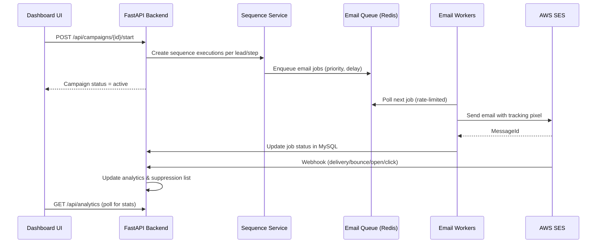

# PersistWizard — Full Website Implementation Documentation

This document describes everything implemented across the **PersistWizard AI Marketing Automation Platform**: the public website, authenticated dashboard, backend API, background workers, and local agent.

---

## Table of Contents

1. [Platform Overview](#platform-overview)
2. [System Architecture](#system-architecture)
3. [Technology Stack](#technology-stack)
4. [Repository Structure](#repository-structure)
5. [Frontend Architecture](#frontend-architecture)
6. [Backend Architecture](#backend-architecture)
7. [Public Website (Marketing Site)](#public-website-marketing-site)
8. [Authentication & User Management](#authentication--user-management)
9. [Dashboard Features](#dashboard-features)
10. [Backend API](#backend-api)
11. [Background Services & Schedulers](#background-services--schedulers)
12. [Data Models](#data-models)
13. [Email System (End-to-End)](#email-system-end-to-end)
14. [LinkedIn Automation](#linkedin-automation)
15. [Social Media Scheduler](#social-media-scheduler)
16. [Local Agent](#local-agent)
17. [Admin Panel](#admin-panel)
18. [Infrastructure & Deployment](#infrastructure--deployment)
19. [Related Documentation](#related-documentation)

---

## Platform Overview

PersistWizard is a **multi-tenant marketing automation platform** for startups and sales teams. Users can:

- Organize work into **projects** (brands/startups)
- Build and manage a **lead database** with bundles, tags, and imports
- Run **multi-step email sequences** with AWS SES delivery and tracking
- **Warm up sender domains** before cold outreach
- Manage a **unified inbox (Unibox)** for inbound replies
- Automate **LinkedIn outreach** via a local desktop agent
- **Schedule social posts** across LinkedIn, Instagram, Facebook, and YouTube
- Monitor **analytics**, deliverability, and campaign performance
- Manage **Workplete product listings** integrated with an external API

The platform consists of three main parts:

| Component | Path | Role |
|-----------|------|------|
| **Frontend** | `persist-wizard/` | Next.js 15 web app (marketing site + dashboard) |
| **Backend** | `backend/` | FastAPI REST API, WebSockets, background workers |
| **Local Agent** | `local-agent/` | Desktop agent for LinkedIn automation via WebSocket |

---

## System Architecture

```
┌─────────────────────────────────────────────────────────────────────────────┐
│                              USER BROWSER                                    │
│  ┌──────────────────────┐         ┌──────────────────────────────────────┐  │
│  │  Marketing Site       │         │  Dashboard (authenticated)            │  │
│  │  /, /privacy, /terms  │         │  /dashboard/*                         │  │
│  └──────────┬───────────┘         └──────────────────┬───────────────────┘  │
└─────────────┼────────────────────────────────────────┼──────────────────────┘
              │  HTTPS / REST                         │
              ▼                                         ▼
┌─────────────────────────────────────────────────────────────────────────────┐
│                     FastAPI Backend (port 8000)                              │
│  ┌─────────────┐  ┌──────────────┐  ┌──────────────┐  ┌──────────────────┐  │
│  │ API Routers │  │ Email Queue  │  │ SES Webhooks │  │ Agent WebSocket  │  │
│  │ /api/*      │  │ + Workers    │  │ + Tracking   │  │ /api/agents/*    │  │
│  └──────┬──────┘  └──────┬───────┘  └──────┬───────┘  └────────┬─────────┘  │
│         │                │                  │                    │           │
│         ▼                ▼                  ▼                    ▼           │
│  ┌─────────────────────────────────────────────────────────────────────┐    │
│  │                    MySQL (SQLAlchemy ORM)                            │    │
│  └─────────────────────────────────────────────────────────────────────┘    │
│         │                │                                                   │
│         ▼                ▼                                                   │
│  ┌─────────────┐  ┌──────────────┐                                          │
│  │ Redis       │  │ AWS SES      │                                          │
│  │ Email Queue │  │ S3 (inbound) │                                          │
│  └─────────────┘  └──────────────┘                                          │
└─────────────────────────────────────────────────────────────────────────────┘
              ▲
              │ WebSocket
┌─────────────┴───────────────────────────────────────────────────────────────┐
│  Local Agent (desktop) — LinkedIn automation, campaign execution             │
│  Control panel: http://localhost:8765                                        │
└─────────────────────────────────────────────────────────────────────────────┘
```

**Startup lifecycle** (`backend/main.py`):

- Verifies MySQL connection
- Starts warm-up scheduler (production only)
- Starts social media post scheduler
- Starts LinkedIn connection monitor, message tracker, and follow-up scheduler
- Recovers pending email queue jobs after a delayed startup window (~1 minute)
- Runs an auto-wake loop (every 30s) for due sequence steps and delayed jobs
- Starts email workers asynchronously at the end of startup

### End-to-End Flow: Starting a Campaign



---

## Technology Stack

### Frontend (`persist-wizard/`)

| Layer | Technology |
|-------|------------|
| Framework | Next.js 15 (App Router) |
| Language | TypeScript |
| Styling | Tailwind CSS, CSS variables for theming |
| UI | Custom component library (`src/components/ui/`) |
| State | React Context (user, campaigns, email, sequences, tags, toast, cache) |
| API Client | Centralized `src/lib/api.ts` (~5,600 lines, singleton `ApiService`) |
| Font | DM Sans via `next/font/google` |

### Backend (`backend/`)

| Layer | Technology |
|-------|------------|
| Framework | FastAPI |
| Language | Python 3.12+ |
| ORM | SQLAlchemy 2.0 |
| Database | MySQL 8 |
| Queue | Redis |
| Email | AWS SES (+ SMTP fallback) |
| AI | Google Gemini |
| Scraping | Selenium, BeautifulSoup, Apify, SerpAPI |
| Auth | JWT + OAuth2 (Google, LinkedIn, Facebook/Instagram, YouTube) |
| Real-time | WebSockets (local agent) |

### Infrastructure

| Service | Purpose |
|---------|---------|
| Docker Compose | Redis, backend, frontend containers |
| AWS SES | Outbound email, domain verification, event webhooks |
| AWS S3 | Inbound email storage |
| Workplete API | External product catalog integration |

---

## Repository Structure

```
ai-marketing-tool/
├── persist-wizard/          # Next.js frontend
│   └── src/
│       ├── app/             # Pages (App Router)
│       ├── components/      # UI and feature components
│       ├── contexts/        # React context providers
│       ├── hooks/           # Custom hooks
│       └── lib/api.ts       # API service layer
├── backend/                 # FastAPI backend
│   ├── main.py              # App entry point
│   ├── config.py            # Environment settings
│   ├── routers/             # API route handlers (35 routers)
│   ├── services/            # Business logic (43 services)
│   ├── models/              # SQLAlchemy models (32 files)
│   └── docs/                # Feature-specific backend docs
├── local-agent/             # Desktop LinkedIn automation agent
├── docs/                    # Project-wide documentation (this file)
└── docker-compose.yml       # Container orchestration
```

---

## Frontend Architecture

The frontend is a **Next.js 15 App Router** application. Pages are file-based routes under `persist-wizard/src/app/`, and feature logic lives in shared components and React contexts.

### Routing Model

Next.js maps each `page.tsx` file to a URL. Layouts nest automatically:

```
src/app/
├── layout.tsx              # Root layout (global providers, fonts, metadata)
├── page.tsx                # /  (marketing landing)
├── privacy/page.tsx        # /privacy
├── terms/page.tsx          # /terms
├── auth/
│   ├── login/page.tsx
│   ├── register/page.tsx
│   ├── forgot-password/page.tsx
│   ├── reset-password/page.tsx
│   └── google/callback/page.tsx
└── dashboard/
    ├── layout.tsx          # Sidebar, auth guard, dashboard providers
    ├── page.tsx            # /dashboard
    ├── campaigns/
    │   ├── page.tsx
    │   └── [id]/page.tsx   # Dynamic campaign detail
    ├── projects/...
    ├── leads/page.tsx
    └── ...                 # One page per sidebar feature
```

**Layouts:**

- **Root layout** (`src/app/layout.tsx`) — wraps the entire app with global providers.
- **Dashboard layout** (`src/app/dashboard/layout.tsx`) — wraps all `/dashboard/*` routes with `ProtectedRoute`, sidebar navigation, onboarding tour, and campaign/email context providers.

### Provider Hierarchy

Global state is managed through nested React Context providers:

```
RootLayout
├── ErrorBoundary
├── ThemeProvider          (light/dark via next-themes)
├── ToastProvider          (global notifications)
├── UserProvider           (auth state, login/logout)
├── CacheManagerProvider   (client-side API cache)
├── DashboardDataProvider  (shared dashboard metrics)
└── ImportProgressProvider (bulk lead import progress)

DashboardLayout (authenticated only)
├── ProtectedRoute
├── TourProvider           (onboarding tour)
├── CampaignsProvider
└── EmailProvider
```

Feature-specific providers are scoped where needed:

- `SequenceProvider` — campaign sequence editor (`/dashboard/campaigns/[id]`)
- `TagsProvider` — lead tagging within campaign detail

### API Client Layer

All backend communication goes through `src/lib/api.ts`:

| Export | Role |
|--------|------|
| `apiService` | Singleton `ApiService` class with ~100+ methods |
| `inboundEmailApi` | Unibox-specific endpoints |
| `replyManagementApi` | Reply thread management |
| TypeScript interfaces | Mirrors backend models (`User`, `Campaign`, `Lead`, etc.) |

**Request flow:**

1. `getApiBaseUrl()` reads `NEXT_PUBLIC_API_URL` (defaults to production if unset).
2. `ApiService` loads JWT from `localStorage` (`auth_token`) on init.
3. Every request attaches `Authorization: Bearer <token>`.
4. On `401`, the registered unauthorized handler clears session and redirects to login.
5. Responses are normalized to `{ success, data?, error? }`.

### Auth Guard Pattern

Dashboard routes use the `ProtectedRoute` component:

```tsx
// persist-wizard/src/components/protected-route.tsx
// - Reads isAuthenticated from UserContext
// - Redirects to /auth/login if unauthenticated
// - Shows full-screen Loading while checking session
```

`UserContext` calls `GET /api/auth/me` on mount to restore sessions from stored tokens.

### Component Organization

| Directory | Purpose |
|-----------|---------|
| `src/components/ui/` | Reusable primitives (Button, Dialog, Table, Badge, etc.) |
| `src/components/campaign-detail/` | Campaign detail tabs (Analytics, Leads, Sequence, Schedule, Options) |
| `src/components/` (root) | Feature components (email-queue-manager, verified-email-manager, etc.) |
| `src/hooks/` | Custom hooks (`use-api-cancellation`, etc.) |
| `src/contexts/` | React context providers |

### Page → Component Mapping (examples)

| Page | Key Components |
|------|----------------|
| `/` | `Header`, `Hero`, `Stats`, `Features`, `Testimonials`, `Pricing`, `Footer` |
| `/dashboard` | Dashboard metrics, charts, activity feed |
| `/dashboard/campaigns/[id]` | `TabsRow`, `AnalyticsTab`, `LeadsTab`, `SequenceTab`, `ScheduleTab`, `OptionTab` |
| `/dashboard/inbound-emails` | `email-queue-manager`, conversation modals |
| `/dashboard/senders` | `verified-email-manager`, `email-configuration` |

### Design System

- **Font:** DM Sans (Google Fonts) via `next/font`
- **Theming:** CSS variables in `globals.css`, toggled by `theme-provider.tsx` (default: dark)
- **Colors:** Indigo primary, Amber accent, Emerald success
- **UI library:** Custom shadcn-style components in `src/components/ui/`

---

## Backend Architecture

The backend follows a **layered FastAPI** pattern:

```
HTTP Request
    → Router (routers/*.py)       # Route definitions, request validation, auth deps
    → Service (services/*.py)     # Business logic, external API calls
    → Model (models/*.py)         # SQLAlchemy ORM entities
    → MySQL database
```

### Entry Point (`backend/main.py`)

1. Sets up logging and Windows asyncio policy (for Playwright).
2. Creates database tables via `Base.metadata.create_all()`.
3. Registers all API routers under `/api/*`.
4. Mounts tracking routes (`/track/open`, `/track/click`, `/unsubscribe`) without `/api` prefix.
5. Configures CORS for the frontend origin.
6. Runs lifespan hooks: schedulers, job recovery, email workers, auto-wake loop.

### Router → Service Pattern

Each router is thin — it validates input, checks auth, and delegates to a service:

```python
# Example pattern (routers/campaigns.py)
@router.post("/{campaign_id}/start")
async def start_campaign(campaign_id: str, db: Session = Depends(get_db), user = Depends(get_current_user)):
    return sequence_service.start_campaign(db, campaign_id, user.id)
```

### Authentication

- **JWT tokens** issued on login/register (`routers/auth.py`)
- **`get_current_user`** dependency validates Bearer token on protected routes
- **Token blacklist** (`models/token_blacklist.py`) for logout
- **OAuth flows** in `oauth_router.py` for Google, LinkedIn, Facebook, Instagram, YouTube

### Database

- **SQLAlchemy 2.0** ORM with session-per-request via `get_db()` dependency
- **MySQL 8** as the primary datastore
- Tables auto-created on startup; migration scripts live in `backend/extras/`

### Redis

Used exclusively for the **email queue**:

- Priority queues (`high`, `normal`, `low`)
- Delayed job sorted set (scheduled sends)
- Wake keys for campaign scheduling windows

### Multi-Tenancy

Data is scoped per user and per project:

- Every entity (leads, campaigns, templates) belongs to a `Project`
- Projects belong to a `User`
- API endpoints filter by `user.id` or `project.user_id`

---

## Public Website (Marketing Site)

### Pages

| Route | Description |
|-------|-------------|
| `/` | Landing page with hero, stats, features, testimonials, pricing |
| `/privacy` | Privacy policy |
| `/terms` | Terms of service |

### Landing Page Sections

Built from reusable components in `persist-wizard/src/components/`:

- **Header** — navigation, auth links
- **Hero** — primary call-to-action
- **Stats** — platform metrics showcase
- **Features** — product capability highlights
- **Testimonials** — social proof
- **Pricing** — plan tiers
- **Footer** — site links and branding

### Design System

See [Frontend Architecture → Design System](#design-system) for fonts, theming, and component library details. The marketing site uses the same design tokens as the dashboard.

---

## Authentication & User Management

### Auth Pages

| Route | Feature |
|-------|---------|
| `/auth/login` | Username/password login |
| `/auth/register` | New account registration |
| `/auth/forgot-password` | Password reset request |
| `/auth/reset-password` | Password reset completion |
| `/auth/google/callback` | Google OAuth callback handler |

### Backend Auth (`/api/auth`)

- JWT access tokens with configurable expiry
- User registration and login
- Current user profile (`GET /api/auth/me`)
- Token blacklist for logout
- Google OAuth (`oauth_router.py`)
- LinkedIn, Facebook, Instagram, and YouTube OAuth for social account connection

### Frontend Auth

- `ProtectedRoute` component guards dashboard routes
- `UserContext` stores auth state and profile
- Automatic token attachment on API requests
- Profile editing from dashboard sidebar (name, username)

---

## Dashboard Features

All authenticated features live under `/dashboard/*`. The sidebar navigation (`dashboard/layout.tsx`) includes:

| Nav Item | Route | Implementation Status |
|----------|-------|----------------------|
| Dashboard | `/dashboard` | ✅ Overview metrics, charts, recent activity, daily limits |
| Projects | `/dashboard/projects` | ✅ CRUD, settings, email/domain config |
| Products | `/dashboard/products` | ✅ Workplete product management |
| Leads | `/dashboard/leads` | ✅ Import, bundles, tags, scoring, filters |
| Campaigns | `/dashboard/campaigns` | ✅ List + detail with sequences |
| Emails (Senders) | `/dashboard/senders` | ✅ Verified sender email management |
| Unibox | `/dashboard/inbound-emails` | ✅ Unified inbox with unread badge |
| LinkedIn Automation | `/dashboard/linkedin-automation` | ✅ Campaign setup (requires local agent) |
| Social Scheduler | `/dashboard/social-scheduler` | ✅ Multi-platform post scheduling |
| Admin Dashboard | `/dashboard/admin` | ✅ Superuser only |

### Additional Dashboard Pages (not in main sidebar)

| Route | Feature |
|-------|---------|
| `/dashboard/campaigns/[id]` | Campaign detail: Analytics, Leads, Sequence, Schedule, Options tabs |
| `/dashboard/projects/[id]` | Single project view |
| `/dashboard/projects/[id]/settings` | Project scheduling and configuration |
| `/dashboard/emails` | Email templates dashboard |
| `/dashboard/emails/all` | All sent emails list |
| `/dashboard/emails/templates/new` | Create email template |
| `/dashboard/emails/templates/edit/[id]` | Edit email template |
| `/dashboard/warm-up` | Email warm-up management (recipients, templates, analytics) |
| `/dashboard/replies` | Reply management and tracking |
| `/dashboard/crm` | CRM with lead status, follow-ups, reply sentiment |
| `/dashboard/scraping` | Lead scraping tools |

### Dashboard Home (`/dashboard`)

Displays:

- Total projects, active leads, email campaigns
- Emails sent/opened/clicked with open and click rates
- Daily email limits (campaign + warm-up)
- Warm-up health scores
- Donut charts for campaign performance
- Recent activity feed
- Quick-action links to key sections

### Projects (`/dashboard/projects`)

- Create and manage multiple marketing projects per user
- Project types: B2B, B2C
- Niche categories: SaaS, ecommerce, consulting, healthcare, etc.
- Brand settings: website URL, target audience, brand voice
- Email domain configuration and SES verification
- Inbound email setup (S3 bucket, SNS)
- Daily send limits, time-between-emails, timezone scheduling
- Per-project scheduling settings component

### Products (`/dashboard/products`)

- Integration with **Workplete** external product API
- Create, edit, and list product listings
- Product image upload via S3 (`/api/media`)
- Routes: list, `new`, `[id]/edit`

### Leads (`/dashboard/leads`)

- Manual lead creation (modals)
- CSV/bulk import with import job tracking
- **Lead bundles** — group leads for campaign targeting (many-to-many)
- **Tags** — organize and filter leads
- Lead status pipeline: new → contacted → interested → qualified → converted/rejected
- Lead types: new lead, existing user, VC, partner, referral
- Apollo and LinkedIn scraping integration (backend)
- Lead search, pagination, and filtering

### Campaigns (`/dashboard/campaigns`)

**List page:**

- Campaign cards with status (draft, active, paused, completed)
- Create campaign modal
- Start/pause/resume controls

**Detail page** (`/dashboard/campaigns/[id]`) — five tabs:

| Tab | Features |
|-----|----------|
| **Analytics** | Real-time stats, performance charts, step-level metrics, failed job retry |
| **Leads** | Attach lead bundles or individual leads, enrollment status |
| **Sequence** | Multi-step email sequence editor with variants, delays, A/B variants |
| **Schedule** | Send windows, timezone, daily limits, time-between-emails |
| **Options** | Sender selection, campaign settings, preflight validation |

### Emails & Senders (`/dashboard/senders`)

- Verified sender email addresses per project
- SES identity verification status
- SPF, DKIM, DMARC deliverability checks
- Domain verification workflow with DNS instructions
- Email configuration component for full domain setup

### Email Templates (`/dashboard/emails/*`)

- Rich text template editor with variable placeholders
- Variables: `{first_name}`, `{last_name}`, `{company}`, `{job_title}`, `{project_name}`, etc.
- Template preview
- Create, edit, and manage templates

### Unibox (`/dashboard/inbound-emails`)

- Unified inbox for campaign replies
- Unread count badge in sidebar (refreshes every 30 seconds)
- Thread view with conversation modal
- Reply directly from the UI
- Attachment download
- Sync inbound emails from SES/S3

### Warm-Up (`/dashboard/warm-up`)

- Gradual email volume scaling (10 → 500 emails/day phases)
- Warm-up recipient management
- Template management for warm-up emails
- Health score and analytics
- Manual warm-up send
- Verified email selection for warm-up

### CRM (`/dashboard/crm`)

- Lead pipeline by CRM status
- Follow-up task management
- Reply tracking and sentiment
- Lead notes and status updates
- CRM analytics and search

### LinkedIn Automation (`/dashboard/linkedin-automation`)

- Create LinkedIn outreach campaigns
- Profile search criteria and connection requests
- Message sequences and follow-ups
- Requires **local agent** connected via WebSocket
- Campaign execution status and profile state tracking

### Social Scheduler (`/dashboard/social-scheduler`)

- Schedule posts to LinkedIn, Instagram, Facebook, YouTube
- OAuth-connected social accounts
- Media upload support
- Post status tracking (scheduled, published, failed)

### Scraping (`/dashboard/scraping`)

- LinkedIn profile scraping
- Apollo lead discovery
- Scraping job status and results

---

## Backend API

Interactive API docs: `http://localhost:8000/docs` (Swagger) and `/redoc`.

### Active API Routers

| Prefix | Router | Purpose |
|--------|--------|---------|
| `/api/auth` | `auth.py`, `oauth_router.py` | Login, register, OAuth |
| `/api/admin` | `admin.py` | Superuser admin panel |
| `/api/projects` | `projects.py`, `sender_emails.py` | Projects and sender emails |
| `/api/products` | `products.py` | Workplete product integration |
| `/api/leads` | `leads.py` | Lead CRUD, import, scraping, bundles |
| `/api/campaigns` | `campaigns.py` | Campaign management |
| `/api/tags` | `tags.py` | Lead tagging |
| `/api/emails` | `emails.py` | Templates, send, AI generation |
| `/api/sequences` | `sequences.py` | Multi-step email sequences |
| `/api/email-config` | `email_config.py` | Domain and email configuration |
| `/api/email-queue` | `email_queue.py` | Queue management, workers, jobs |
| `/api/ses` | `ses_webhooks.py` | SES bounce/complaint/delivery events |
| `/api/crm` | `crm.py` | CRM status and follow-ups |
| `/api/inbound-emails` | `inbound_emails.py` | Inbound email sync and replies |
| `/api/replies` | `reply_management.py` | Reply tracking and threads |
| `/api/linkedin-automation` | `linkedin_automation.py` | LinkedIn campaign API |
| `/api/linkedin` | `linkedin_outreach.py` | LinkedIn outreach (OpenOutreach) |
| `/api/deliverability` | `deliverability.py` | SPF/DKIM/DMARC status |
| `/api/warm-up` | `warm_up.py` | Warm-up system |
| `/api/warm-up/admin` | `warm_up_admin.py` | Admin warm-up controls |
| `/api/agents` | `agent_router.py` | WebSocket + agent download |
| `/api/verified-emails` | `verified_emails.py` | Email verification |
| `/api/openoutreach/webhooks` | `openoutreach_webhooks.py` | OpenOutreach callbacks |
| `/api/scheduler` | `scheduler_router.py` | Social post scheduling |
| `/api/media` | `media_router.py` | File/media upload |
| `/api/analytics` | `analytics.py` | Dashboard analytics |

### Tracking Routes (no `/api` prefix)

| Route | Purpose |
|-------|---------|
| `GET /track/open/{tracking_id}` | Email open pixel |
| `GET /track/click/{tracking_id}` | Link click redirect |
| `GET /unsubscribe/{tracking_id}` | Unsubscribe handler |
| `GET /verified-emails/verify` | Email verification link |

### Commented Out (code exists, not mounted in `main.py`)

- `/api/social` — Social accounts router
- `/api/posts` — Social posts router
- `/api/calls` — Twilio calling
- `/api/scraping` — Standalone scraping router (scraping also available via leads router)

---

## Background Services & Schedulers

| Service | File | Purpose |
|---------|------|---------|
| Email Queue Service | `email_queue_service.py` | Redis queue, job creation, campaign sync |
| Email Worker | `email_worker.py` | Parallel email sending workers |
| Sequence Service | `sequence_service.py` | Multi-step sequence execution |
| Warm-Up Scheduler | `warm_up_scheduler.py` | Automatic warm-up phase advancement |
| Warm-Up Service | `warm_up_service.py` | Warm-up email logic and limits |
| Social Scheduler | `social_scheduler.py` | Publishes scheduled social posts |
| LinkedIn Connection Monitor | `linkedin_connection_monitor.py` | Tracks connection acceptances |
| LinkedIn Message Tracker | `linkedin_message_tracker.py` | Tracks message delivery/read |
| LinkedIn Follow-up Scheduler | `linkedin_followup_scheduler.py` | Automated follow-up messages |
| SES Event Handler | `ses_event_handler.py` | Processes bounce/complaint/delivery |
| SES Inbound Service | `ses_inbound_service.py` | Processes inbound emails from S3 |
| Inbound Email Processor | `inbound_email_processor.py` | Parses and stores inbound mail |
| Reply Tracking Service | `reply_tracking_service.py` | Reply detection and CRM updates |
| Agent Service | `agent_service.py` | WebSocket agent connections |
| AI Service | `ai_service.py` | Gemini-powered content generation |
| Analytics Service | `analytics_service.py` | Metrics aggregation |
| Domain Verification | `domain_verification_service.py` | DNS verification checks |
| Scraping Services | `scraping_service.py`, `apollo_scraper_service.py`, `linkedin_scraper_service.py` | Lead discovery |
| OpenOutreach Client | `openoutreach_client.py` | External LinkedIn automation |
| Workplete Service | `workplete_service.py` | Product API integration |

---

## Data Models

Key SQLAlchemy models in `backend/models/`:

| Model | Purpose |
|-------|---------|
| `User` | Accounts, roles (`is_superuser`, `is_active`) |
| `Project` | Multi-tenant projects with email/scheduling config |
| `Lead` | Contact records with status, type, CRM fields |
| `LeadBundle` | Grouped leads for campaign targeting |
| `Tag` | Lead tags |
| `Campaign` | Email outreach campaigns |
| `EmailTemplate` | Reusable email templates |
| `EmailSequence` / `SequenceStep` / `SequenceVariant` / `SequenceExecution` | Multi-step sequences |
| `InboundEmail` / `EmailReply` / `InboundEmailAttachment` | Unibox data |
| `UserReply` / `ConversationThread` | Reply management |
| `WarmUpEmail` / `WarmUpRecipient` / `WarmUpMetrics` / `WarmUpTemplate` | Warm-up system |
| `EmailSuppression` / `DomainBackoff` | Deliverability protection |
| `LinkedInCampaign` / `LinkedInCampaignProfile` / `LinkedInAccount` | LinkedIn automation |
| `ScrapeJob` / `ScrapedProfile` | Scraping jobs |
| `ScheduledPost` / `SocialAccount` | Social scheduling |
| `ImportJob` | Bulk lead import tracking |
| `StandaloneEmail` | Individual sent emails |
| `TokenBlacklist` | Logged-out JWT tokens |

---

## Email System (End-to-End)

### Outbound Flow

```
User starts campaign
    → Sequence Service creates executions per lead/step
    → Email Queue Service enqueues jobs (Redis)
    → Email Workers pick jobs (rate-limited per project)
    → SES sends email with tracking pixel + wrapped links
    → SES webhooks update delivery/bounce/complaint status
```

### Key Capabilities

- **AWS SES** primary delivery with domain verification (SPF, DKIM, DMARC)
- **Redis queue** with priority levels, retry with exponential backoff
- **Rate limiting** — daily limits, time-between-emails, timezone windows
- **Warm-up phases** — gradual volume increase before cold outreach
- **Multi-step sequences** — delays, variants, conditional steps
- **Tracking** — opens, clicks, unsubscribes, bounces, complaints
- **Suppression list** — auto-suppress bounced/complained addresses
- **AI email generation** — Gemini-powered subject/body via `/api/emails/generate-ai-email`
- **Preflight validation** — checks before campaign start

### Inbound Flow

```
Reply arrives at SES → S3 bucket → Lambda/webhook → Backend
    → Inbound Email Processor parses content
    → Matched to campaign/lead
    → Appears in Unibox
    → CRM status updated via Reply Tracking Service
```

---

## LinkedIn Automation

### Architecture

1. User creates a LinkedIn campaign in the dashboard
2. **Local agent** connects to backend via WebSocket (`/api/agents/connect`)
3. Backend sends commands (search, connect, message) to the agent
4. Agent executes via Playwright/browser automation
5. Results flow back: profile states, connection status, message delivery

### Backend Components

- `agent_router.py` — WebSocket endpoint, agent download, command dispatch
- `linkedin_campaign_service.py` — Campaign lifecycle
- `linkedin_connection_monitor.py` — Monitors accepted connections
- `linkedin_message_tracker.py` — Tracks message status
- `linkedin_followup_scheduler.py` — Schedules follow-up messages
- `openoutreach_webhooks.py` — External OpenOutreach integration

### Profile States

`new` → `connection_sent` → `connected` → `message_sent` → `replied` / `failed`

---

## Social Media Scheduler

- Connect accounts via OAuth (LinkedIn, Facebook, Instagram, YouTube/Google)
- Create scheduled posts with text and media
- `social_scheduler.py` publishes due posts in the background
- Post statuses: scheduled, publishing, published, failed
- Media upload via `/api/media`

---

## Local Agent

Located in `local-agent/`. See `local-agent/USER_GUIDE.md` for setup.

| Feature | Detail |
|---------|--------|
| Install | `INSTALL.bat` (Windows) or `INSTALL.sh` (Mac/Linux) |
| Control Panel | `http://localhost:8765` |
| Connection | WebSocket to backend, auto-token on web login |
| Purpose | Execute LinkedIn campaigns locally (browser automation) |
| Auto-start | Configured to start on system login |

---

## Admin Panel

**Route:** `/dashboard/admin` (requires `is_superuser=True`)

| Feature | Description |
|---------|-------------|
| System stats | Users, projects, campaigns, emails across platform |
| User management | Search, edit, activate/deactivate, grant admin |
| Campaign overview | All campaigns with performance metrics |
| System health | Database, email queue, warm-up, import jobs |
| Metrics | 7-day/30-day email trends, user growth, top campaigns |

API: `/api/admin/dashboard/stats`, `/api/admin/users`, `/api/admin/campaigns`, `/api/admin/metrics`

See `backend/docs/ADMIN_FEATURES.md` for full details.

---

## Infrastructure & Deployment

### Docker Compose (`docker-compose.yml`)

| Service | Port | Image |
|---------|------|-------|
| Redis | 6379 | `redis:7-alpine` |
| Backend | 8000 | Built from `backend/Dockerfile` |
| Frontend | 3000 | Built from `persist-wizard/` |

### Environment Variables (key)

| Variable | Purpose |
|----------|---------|
| `MYSQL_*` | Database connection |
| `REDIS_URL` | Email queue |
| `AWS_*` | SES email sending |
| `GEMINI_API_KEY` | AI content generation |
| `SECRET_KEY` | JWT signing |
| `GOOGLE_CLIENT_*` | Google/YouTube OAuth |
| `LINKEDIN_CLIENT_*` | LinkedIn OAuth |
| `FACEBOOK_APP_*` | Facebook/Instagram OAuth |
| `TRACKING_DOMAIN` | Email tracking URLs |
| `FRONTEND_URL` / `BACKEND_URL` | CORS and redirects |
| `WORKPLETE_API_URL` | Product integration |
| `APIFY_API_KEY` / `SERPAPI_KEY` | Lead scraping |
| `DEVELOPMENT_MODE` | Disables production schedulers |

### Local Development

```bash
# Backend
cd backend
python -m venv myenv && myenv\Scripts\activate
pip install -r requirements.txt
python main.py          # http://localhost:8000

# Frontend
cd persist-wizard
npm install
npm run dev             # http://localhost:3000
```

Frontend env (`.env.local`):

```env
NEXT_PUBLIC_API_URL=http://localhost:8000
NEXT_PUBLIC_TRACKING_DOMAIN=http://localhost:8000
```

> `getApiBaseUrl()` in `api.ts` automatically appends `/api` if missing.

### Production (Docker Compose)

```bash
docker compose up -d    # Starts Redis, backend (:8000), frontend (:3000)
```

The frontend container receives `NEXT_PUBLIC_API_URL=http://backend:8000` (internal Docker network). MySQL is expected to be external — connection vars are passed from the host `.env` file.

---

## Related Documentation

| Document | Location | Topic |
|----------|----------|-------|
| Backend README | `backend/README.md` | Setup, API overview |
| Frontend README | `persist-wizard/README.md` | Frontend setup, design system |
| System Flow Diagram | `backend/docs/SYSTEM_FLOW_DIAGRAM.md` | Architecture diagrams |
| Email Queue Setup | `backend/docs/EMAIL_QUEUE_SETUP.md` | Queue and warm-up |
| AWS SES Tracking | `backend/docs/AWS_SES_TRACKING_SETUP.md` | SES event tracking |
| Inbound Email Setup | `backend/docs/INBOUND_EMAIL_SETUP.md` | Reply ingestion |
| SES Inbound Setup | `backend/docs/SES_INBOUND_SETUP.md` | S3/Lambda inbound |
| Multi-Tenant Email | `backend/docs/MULTI_TENANT_EMAIL_SETUP.md` | Per-project email |
| CRM Reply Tracking | `backend/docs/CRM_REPLY_TRACKING.md` | CRM integration |
| Reply Feature | `backend/docs/REPLY_FEATURE_DOCUMENTATION.md` | Reply management |
| Lead Bundles | `backend/docs/LEAD_BUNDLE_MANY_TO_MANY.md` | Bundle architecture |
| Admin Features | `backend/docs/ADMIN_FEATURES.md` | Admin panel |
| Production Deployment | `backend/docs/PRODUCTION_DEPLOYMENT.md` | Deploy guide |
| Local Agent Guide | `local-agent/USER_GUIDE.md` | Agent installation |

---

## Feature Implementation Summary

| Area | Status | Notes |
|------|--------|-------|
| User auth (JWT + OAuth) | ✅ Implemented | Google, LinkedIn, Facebook, Instagram, YouTube |
| Multi-project management | ✅ Implemented | Full CRUD with settings |
| Lead management | ✅ Implemented | Import, bundles, tags, scraping |
| Email sequences | ✅ Implemented | Multi-step with variants and scheduling |
| Email queue + workers | ✅ Implemented | Redis-backed with retry |
| AWS SES delivery | ✅ Implemented | Domain verification, tracking |
| Email warm-up | ✅ Implemented | Phased volume scaling |
| Inbound email (Unibox) | ✅ Implemented | S3 + reply UI |
| CRM + reply tracking | ✅ Implemented | Status pipeline, follow-ups |
| Campaign analytics | ✅ Implemented | Real-time stats, charts |
| LinkedIn automation | ✅ Implemented | Requires local agent |
| Social scheduler | ✅ Implemented | 4 platforms |
| Product management | ✅ Implemented | Workplete integration |
| Admin panel | ✅ Implemented | Superuser only |
| AI content generation | ✅ Implemented | Gemini |
| Deliverability checks | ✅ Implemented | SPF/DKIM/DMARC |
| Phone calling (Twilio) | ⚠️ Code exists | Router not mounted |
| Standalone social posts | ⚠️ Code exists | Router not mounted |

---

*Last updated: June 2026*
