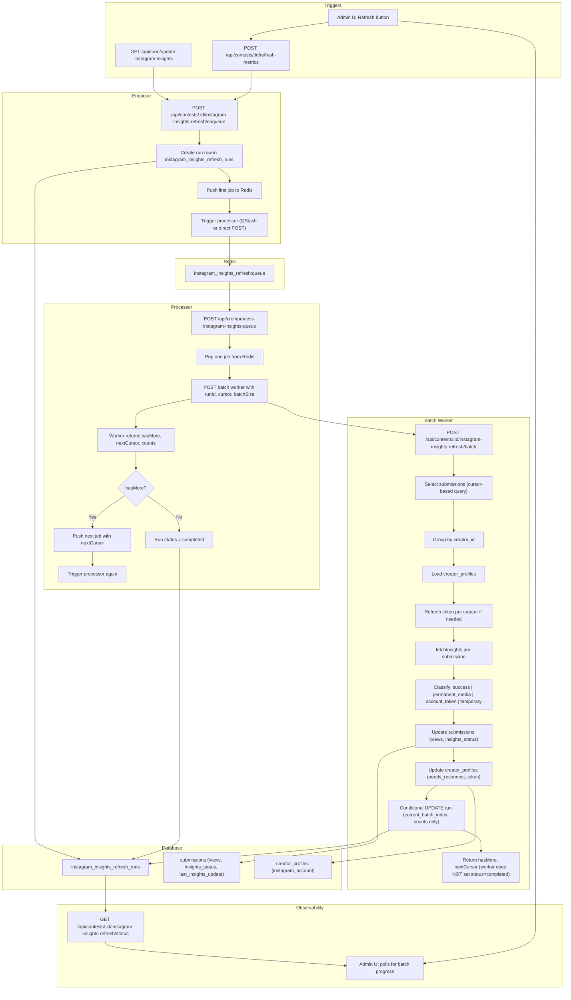

# Instagram Insights Refresh – Architecture Validation

This document validates the proposed scalable Instagram insights refresh design against the existing codebase (Twitter metrics queue, QStash, update-instagram-insights) and recommends concrete adjustments before implementation.

---

## Final Architecture Diagram



**Flow summary:** Triggers call the enqueue endpoint → run is created and first job pushed to Redis → processor is triggered (QStash or direct POST). Processor pops one job (or uses RPOPLPUSH for crash safety), calls the batch worker with cursor → worker checks run is still `running`, selects a batch (with `last_insights_update < run.started_at` for idempotency), fetches insights with rate limit (e.g. p-limit(5)), classifies errors, updates submissions/creators and conditionally updates run progress (counts only). Worker returns `hasMore` and `nextCursor`; **only the processor** sets `run.status = 'completed'` when `hasMore === false`. Status endpoint reads the run row for admin progress (Batch X processing, Y / Z processed).

---

## Exact File Structure

**New files (create):**

| Path | Purpose |
|------|--------|
| `lib/queue/instagram-insights-queue.ts` | Redis queue: enqueue/pop (pop via RPOPLPUSH for crash safety; Improvement 4), `removeFromProcessing`, type `InstagramInsightsJob` (contestId, runId, batchIndex, batchSize, totalBatches, cursor?) |
| `lib/instagram-insights.ts` | Shared helpers: `refreshToken`, `fetchInsights` (returns success/error union), `classifyInsightsError`, `hasStatsChanged`, `updateCpmContestBudgets`; used by cron and batch worker |
| `app/api/cron/process-instagram-insights-queue/route.ts` | Processor: auth, pop job (RPOPLPUSH to processing list), POST batch worker, on success LREM from processing; if hasMore enqueue next + trigger self; if !hasMore set run.status=completed |
| `app/api/contests/[id]/instagram-insights-refresh/enqueue/route.ts` | Enqueue: validate contest, count eligible, create run (or return existing), push first job, trigger processor |
| `app/api/contests/[id]/instagram-insights-refresh/batch/route.ts` | Batch worker: fromQueue auth, check run.status (exit if cancelled/failed), cursor-based select with run.started_at guard, rate limit (e.g. p-limit(5)), classify, update submissions/creators/run, return hasMore + nextCursor (worker does NOT set status=completed) |
| `app/api/contests/[id]/instagram-insights-refresh/status/route.ts` | GET: return latest run for contest (for admin polling) |
| `app/api/contests/[id]/instagram-insights-refresh/cancel/route.ts` | POST: set run status = cancelled (admin abort; Improvement 3) |
| `SUPABASE/migrations/YYYYMMDD_instagram_insights_refresh_runs.sql` | Create table `instagram_insights_refresh_runs`, partial unique index, add `insights_status` + composite index on `submissions` |

**Modified files (edit):**

| Path | Change |
|------|--------|
| `lib/qstash.ts` | Add `triggerProcessInstagramInsightsQueue(baseUrl?)`, `getProcessInstagramInsightsQueueUrl()`, `authorizeProcessInstagramInsightsQueue(request, rawBody)` (or parameterized verify with Instagram URL) |
| `app/api/cron/update-instagram-insights/route.ts` | Thin orchestrator: call enqueue endpoint for contestId or all active contests; move fetch/refresh/CPM logic to `lib/instagram-insights.ts` and call from here when queue disabled (optional sync fallback) |
| `app/api/contests/[id]/refresh-metrics/route.ts` | For platform Instagram + queue enabled: call Instagram enqueue endpoint, return `{ queued: true, runId }`; optionally pass through to existing cron when queue disabled |
| `app/dashboard/contests/[id]/contest-detail-client.tsx` (or equivalent) | When contest is Instagram and refresh was queued, poll `GET .../instagram-insights-refresh/status` until run completed, then reload (mirror Twitter `last-metrics-updated` polling) |
| `types/supabase.ts` | Regenerate or manually add: `instagram_insights_refresh_runs` table type, `submissions.insights_status` |

**Directory tree (new and touched):**

```
lib/
  queue/
    metrics-refresh-queue.ts     (existing)
    instagram-insights-queue.ts  (NEW)
  instagram-insights.ts          (NEW)
  qstash.ts                     (MODIFY)

app/api/
  cron/
    update-instagram-insights/
      route.ts                  (MODIFY)
    process-metrics-queue/
      route.ts                  (existing)
    process-instagram-insights-queue/
      route.ts                  (NEW)
  contests/
    [id]/
      refresh-metrics/
        route.ts                (MODIFY)
      last-metrics-updated/
        route.ts                (existing)
      instagram-insights-refresh/
        enqueue/
          route.ts              (NEW)
        batch/
          route.ts              (NEW)
        status/
          route.ts              (NEW)
        cancel/
          route.ts              (NEW)

SUPABASE/
  migrations/
    YYYYMMDD_instagram_insights_refresh_runs.sql   (NEW)

types/
  supabase.ts                   (MODIFY if regenerating from DB)

app/dashboard/contests/[id]/
  contest-detail-client.tsx     (MODIFY for Instagram status polling)
```

---

## Architecture Improvements (Final)

These six improvements are part of the final design and must be implemented.

### Improvement 1 — Worker does NOT decide completion

- **Rule:** The worker only returns `hasMore` and `nextCursor`. It never sets `run.status = 'completed'`.
- **Logic:** Worker detects last batch when the cursor-based query returns fewer rows than `batchSize` (or no rows). It then returns `hasMore: false`. The **processor**, on receiving `hasMore === false`, updates the run: `UPDATE instagram_insights_refresh_runs SET status = 'completed', finished_at = now() WHERE id = :runId`.
- **Reason:** Worker has the cursor and knows if the query returned &lt; batchSize; the processor owns run lifecycle and marks completion. Keeps responsibilities clear.

### Improvement 2 — Idempotency safety (run.started_at guard)

- **Rule:** Only update submissions that are “stale” relative to **this run’s** `started_at`, so the same job running twice (or a retry) does not double-count and we do not overwrite updates from a newer run.
- **Batch selection (cursor query):** Add to the WHERE clause:  
  `AND (last_insights_update IS NULL OR last_insights_update < :runStartedAt)`  
  Use `run.started_at` from the run row as `runStartedAt`.
- **UPDATE submissions:** When writing updates, restrict by run start time:  
  `UPDATE submissions SET views = ..., last_insights_update = now(), insights_status = ... WHERE id IN (:ids) AND (last_insights_update IS NULL OR last_insights_update < :runStartedAt)`  
  So if the same batch runs twice, the second run’s UPDATE will affect 0 rows (already updated), and the conditional run progress update (current_batch_index) still prevents double-count.

### Improvement 3 — Run cancellation support

- **Schema:** Allow `status = 'cancelled'` in `instagram_insights_refresh_runs` (in addition to pending, running, completed, failed).
- **API:** Expose e.g. `POST /api/contests/:contestId/instagram-insights-refresh/cancel` (or PATCH run with status=cancelled) so admin can abort a refresh. Set `status = 'cancelled'`, `finished_at = now()`.
- **Worker:** At the start of each batch, load the run row. If `run.status` is not `'running'` (e.g. `cancelled` or `failed`), do not process; return 200 with `hasMore: false` and no run progress update so the processor does not enqueue more jobs. Optionally return a body like `{ hasMore: false, cancelled: true }` so the processor can avoid marking run as completed.

### Improvement 4 — Processor crash recovery (RPOPLPUSH pattern)

- **Problem:** If the processor crashes after popping a job (RPOP) but before the worker completes, the job is lost.
- **Pattern:** Use **RPOPLPUSH** (or BRPOPLPUSH): atomically move the job from the main queue to a “processing” list (e.g. `instagram_insights_refresh:processing`). After the worker succeeds, **LREM** the job from the processing list. If the processor crashes, the job remains in the processing list.
- **Recovery:** Optional: a small cron or scheduled task that re-enqueues items from the processing list that are older than e.g. 15 minutes (stale = crash). Or use a TTL on processing list entries if supported. Upstash Redis supports RPOPLPUSH; implement in `lib/queue/instagram-insights-queue.ts` (e.g. `popJob()` does RPOPLPUSH to processing list; add `removeFromProcessing(job)` or `completeJob(job)` that LREM the job from processing).
- **Implementation note:** When enqueueing the “next” job, push to the main queue as today. Only the “pop” side changes to RPOPLPUSH; completion removes from processing.

### Improvement 5 — Required DB indexes

Ensure these indexes exist (add in the same migration as the new table and column):

**Table: `submissions`**

- `contest_id` — likely already exists (`idx_submissions_contest_id`).
- Composite for batch query and cursor ordering:  
  `CREATE INDEX idx_submissions_instagram_insights_batch ON submissions (contest_id, platform, last_insights_update ASC NULLS FIRST, id) WHERE platform = 'instagram' AND video_id IS NOT NULL;`
- For admin filters by status:  
  `CREATE INDEX idx_submissions_insights_status ON submissions (contest_id, insights_status) WHERE platform = 'instagram';`

**Table: `creator_profiles`**

- Primary key on `id` is sufficient (no extra index needed unless you have other queries).

**Table: `instagram_insights_refresh_runs`**

- Partial unique index (one active run per contest):  
  `CREATE UNIQUE INDEX idx_instagram_refresh_runs_one_active ON instagram_insights_refresh_runs (contest_id) WHERE status IN ('pending', 'running');`
- For status endpoint and listing:  
  `CREATE INDEX idx_instagram_refresh_runs_contest_id ON instagram_insights_refresh_runs (contest_id);`  
  `CREATE INDEX idx_instagram_refresh_runs_status ON instagram_insights_refresh_runs (status) WHERE status IN ('pending', 'running');`

Verify in migration that no duplicate or redundant indexes are created (e.g. if `contest_id` is the only filter, one index per table may suffice; the composite is for the batch query).

### Improvement 6 — Rate limit protection (Instagram API)

- **Rule:** Limit concurrency of outbound calls to the Instagram Graph API so the worker does not trigger rate limits.
- **Options:**  
  - **Per-creator sequential:** Already the case if you process one creator at a time and then all their submissions sequentially.  
  - **Limit concurrent creators:** Use e.g. `p-limit` (or a simple semaphore) so at most N creators are “in flight” at once (e.g. N = 5). Process submissions per creator sequentially; multiple creators up to N in parallel.  
  - **Limit concurrent submission fetches:** If you ever parallelize within a batch, cap concurrency (e.g. `p-limit(5)` for `fetchInsights` calls).
- **Recommendation:** Process creators in sequence (for loop over creators, then for each creator loop over their submissions). If you later parallelize by creator, add `p-limit(5)` so at most 5 creators are fetching at once. Document in worker code that Instagram rate limits apply and this limit is the protection.

---

## 1. Architecture Validation

**Proposed structure:** Enqueue endpoint → Redis queue (Instagram key) → Queue processor route → Batch worker route → Refresh run tracking table.

**Alignment with codebase:**

- **Twitter flow:** [app/api/contests/[id]/refresh-metrics/route.ts](app/api/contests/[id]/refresh-metrics/route.ts) branches on platform; for Twitter it enqueues a job and triggers the processor. Instagram should follow the same pattern: when platform is Instagram and queue is enabled, call an **Instagram enqueue endpoint** (or inline enqueue) and trigger the **Instagram processor** (separate from Twitter).
- **Processor → worker:** [app/api/cron/process-metrics-queue/route.ts](app/api/cron/process-metrics-queue/route.ts) pops one job, calls the worker URL with `fromQueue`, `batchIndex`, `totalBatches`, and gets back `hasMore`; if `hasMore` it enqueues the next job and re-triggers. Instagram processor should do the same but pop from the Instagram queue and call the Instagram batch worker.
- **Run tracking:** Twitter has no DB run table; it uses Redis batch state and `contest.last_metrics_updated`. Instagram’s `instagram_insights_refresh_runs` table is an improvement for history and observability and does not conflict with existing patterns.

**Recommendation:** Keep the proposed structure. Add a dedicated enqueue path for Instagram in `refresh-metrics` (or a dedicated `POST /api/contests/:contestId/instagram-insights-refresh/enqueue`) and a dedicated processor route so Twitter and Instagram queues remain independent.

---

## 2. Queue Implementation Review

**Separate Redis key:** Use a distinct key so Twitter and Instagram do not mix, e.g. `instagram_insights_refresh:queue` (or `metrics_refresh:instagram:queue` under a shared prefix if you prefer).

**Job payload:** Define `InstagramInsightsJob` with at least: `contestId`, `runId`, `batchIndex`, `batchSize`, `totalBatches`. If using cursor-based pagination (recommended below), add `cursor?: { last_insights_update: string | null; id: string }`.

**Enqueue / pop:** Mirror [lib/queue/metrics-refresh-queue.ts](lib/queue/metrics-refresh-queue.ts): same Redis client pattern (`getRedis()`, `Redis.fromEnv()`), `rpush` to enqueue, `rpop` to pop (LIFO so the most recently requested contest is processed first). Implement in a new file e.g. `lib/queue/instagram-insights-queue.ts`.

**QStash integration:** [lib/qstash.ts](lib/qstash.ts) currently hardcodes the URL for `process-metrics-queue`. For the Instagram processor you have two options:

- **Option A (recommended):** Add `triggerProcessInstagramInsightsQueue(baseUrl?: string)` that calls `client.publishJSON({ url: ${baseUrl}/api/cron/process-instagram-insights-queue`, body: {}, method: 'POST' })`. Add `getProcessInstagramInsightsQueueUrl()` and use it in the Instagram processor’s auth: either a new `authorizeProcessInstagramInsightsQueue(request, rawBody)` that verifies QStash signature against the Instagram URL, or generalize `verifyQStashSignature(request, rawBody, canonicalUrl?)` to accept an optional URL (default current process-metrics-queue URL).
- **Option B:** Single processor that reads a “type” from the job and dispatches to Twitter or Instagram worker. That would require a shared queue and job union type and is a larger change; Option A keeps clear separation.

**Recommendation:** Separate queue module, separate processor route, and new QStash trigger + verification for the Instagram processor URL (Option A).

---

## 3. Batch Processing Strategy

**Batch size:** 100–150 submissions per batch is reasonable and keeps each invocation within serverless limits.

**Avoid OFFSET:** The plan’s “batch selection” should not use `OFFSET (batchIndex * batchSize)` for large contests; OFFSET is slow and can shift if rows change between batches.

**Recommended: cursor-based pagination**

- Order candidates by `(last_insights_update ASC NULLS FIRST, id ASC)` (deterministic).
- Each batch: select the next `batchSize` rows where `(last_insights_update, id) > (cursor_t, cursor_id)` (or `WHERE last_insights_update IS NULL AND id > cursor_id` for the first page when cursor is null). Use a composite cursor, e.g. `{ last_insights_update: string | null; id: string }`.
- Worker returns `nextCursor` in the response; the processor enqueues the next job with that cursor. First job has no cursor (or cursor = { last_insights_update: null, id: '' }).
- **Index:** Composite index on `(contest_id, platform, last_insights_update, id)` or at least `(contest_id, last_insights_update, id)` with `platform = 'instagram'` in the query so the cursor range scan is efficient.

**Determinism and retries:** With cursor-based pagination, the same batch (same cursor) always selects the same set of rows. If a job is retried, submission updates are idempotent (overwrite with same or newer data). Run progress updates should be conditional (see Idempotency below).

**Alternative:** At run creation, run a single query to get all eligible submission IDs (ordered), store them in the run row (e.g. `submission_ids jsonb`) or in Redis with TTL, and have each batch job fetch IDs for `batchIndex` only. That avoids OFFSET and is deterministic but stores many UUIDs per run; cursor-based is lighter and scales better.

---

## 4. Idempotency & Retry Safety

**Submissions:** Updates are idempotent: writing `views`, `other_stats`, `last_insights_update`, `insights_status` again with the same or newer values is safe. Re-running the same batch does not corrupt data. **Improvement 2** adds a guard: only update rows where `last_insights_update IS NULL OR last_insights_update < run.started_at` in both the batch selection query and the UPDATE statement, so the same job running twice does not overwrite newer data and run progress is not double-counted.

**Run row:** To avoid double-counting when QStash or the processor retries a job, make run updates **conditional** on the current batch index:

- When processing batch `batchIndex`, at the end:  
  `UPDATE instagram_insights_refresh_runs SET processed_submissions = processed_submissions + :count, current_batch_index = :batchIndex + 1, last_batch_completed_at = now(), status = 'running', ... WHERE id = :runId AND current_batch_index = :batchIndex`
- Only one execution of the same batch will match the `WHERE`; retries will see `current_batch_index` already advanced and can either no-op or return success without updating again.

**Mid-batch crash:** If the worker crashes after updating some submissions but before the run update, the run stays at the previous batch. On recovery you could either: (1) re-enqueue the same batch (cursor or batchIndex) so it runs again (submission updates idempotent, run update will then succeed once); or (2) mark the run as failed and allow a new run. Prefer (1) by re-enqueuing the same job on 5xx or timeout so the batch is retried.

**Token updates:** Refreshing a token and writing it back to `creator_profiles` is idempotent (same token or newer). Multiple writes for the same creator in the same batch are safe if you dedupe token updates by creator_id before applying.

---

## 5. Database Design Review

**Table: `instagram_insights_refresh_runs`**

- **Columns:** As in the plan: `id`, `contest_id`, `status` (values: pending, running, completed, failed, cancelled), `total_submissions`, `processed_submissions`, `success_count`, `permanent_failure_count`, `temporary_failure_count`, `skipped_recent_count`, `current_batch_index`, `total_batches`, `started_at`, `finished_at`, `last_batch_completed_at`, optional `error_message` (if you ever need to store a short failure reason; plan says no status messages in DB, so this can be omitted or used only for terminal failures).
- **Partial unique index:** `CREATE UNIQUE INDEX idx_instagram_refresh_runs_one_active_per_contest ON instagram_insights_refresh_runs (contest_id) WHERE status IN ('pending', 'running');` so at most one active run per contest.
- **Other indexes:** `(contest_id)` for listing runs for a contest; `(status)` where status in ('pending','running') for “all active runs” if needed. PK on `id` is sufficient for lookups by runId.

**Submissions: `insights_status`**

- Add column: `insights_status text` (or enum) with values `null`, `'ok'`, `'permanent_failure'`, `'temporary_failure'`.
- **Indexes (Improvement 5):**
  - Composite for batch query and cursor:  
    `CREATE INDEX idx_submissions_instagram_insights_batch ON submissions (contest_id, platform, last_insights_update ASC NULLS FIRST, id) WHERE platform = 'instagram' AND video_id IS NOT NULL;`
  - For admin UI filters:  
    `CREATE INDEX idx_submissions_insights_status ON submissions (contest_id, insights_status) WHERE platform = 'instagram';`

**Existing indexes:** [DEFINITIONS/submissions.txt](DEFINITIONS/submissions.txt) and schema show `idx_submissions_contest_id`. The new composite index above is important for the cursor-based batch query; add it in the same migration that adds `insights_status`.

---

## 6. Query Performance Review

**Planned batch selection (cursor-based, with idempotency guard):**

Use `run.started_at` so we only consider submissions that have not been updated since this run started (Improvement 2):

```sql
SELECT id, creator_id, video_id, views, other_stats, last_insights_update
FROM submissions
WHERE contest_id = :contestId
  AND platform = 'instagram'
  AND video_id IS NOT NULL
  AND (insights_status IS NULL OR insights_status != 'permanent_failure')
  AND (last_insights_update IS NULL OR last_insights_update < :runStartedAt)
  AND (
    (last_insights_update IS NULL OR last_insights_update < :freshnessCutoff)
    OR (insights_status = 'temporary_failure' AND (last_insights_update IS NULL OR last_insights_update < :oneDayAgo))
  )
  AND (:cursorId = '' OR (last_insights_update, id) > (:cursorT, :cursorId))
ORDER BY last_insights_update ASC NULLS FIRST, id ASC
LIMIT :batchSize;
```

When updating submissions, restrict: `WHERE id IN (:ids) AND (last_insights_update IS NULL OR last_insights_update < :runStartedAt)`.

- For “first page”, pass `cursorId = ''` and `cursorT = null` and the condition `(:cursorId = '' OR ...)` is true (or use a separate branch without the cursor predicate).
- Composite index `(contest_id, platform, last_insights_update, id)` with `platform = 'instagram'` (and optionally `video_id IS NOT NULL`) makes this efficient.
- **Creator filter (needs_reconnect):** Submissions are joined to creator_profiles for `instagram_account.needs_reconnect`. Options: (1) filter in application after fetching the batch (fetch batchSize + buffer, then filter out creators with needs_reconnect unless last_insights_update &lt; 1 day); or (2) add a subquery/join. (1) is simpler and avoids complex indexes; for 100–150 rows per batch the extra rows are acceptable. Alternatively store a denormalized `creator_needs_instagram_reconnect boolean` on submissions and maintain it when we set needs_reconnect; that would allow an index-friendly filter but adds write complexity.

**Recommendation:** Use the cursor query above with the composite index. For needs_reconnect, either filter in app after fetching by creator, or add a small “eligible creator” check per batch (e.g. load creator_ids for the batch and filter by instagram_account.needs_reconnect and last attempt time).

---

## 7. Creator Token Handling

**Current behavior:** [app/api/cron/update-instagram-insights/route.ts](app/api/cron/update-instagram-insights/route.ts) groups submissions by creator, loads `creator_profiles.instagram_account`, refreshes token once per creator when `isTokenExpiring(token_expiry)`, then iterates over that creator’s submissions with the same (possibly refreshed) token. Token updates are collected in `tokenUpdates` and written with `Promise.allSettled` after the loop.

**Batch worker:** Preserve this pattern: for each batch, group submissions by `creator_id`, fetch creator_profiles for those IDs, refresh token at most once per creator, then process all submissions for that creator with the same token. Write token updates back in a single batch (e.g. by creator_id) so multiple submissions for the same creator result in one DB update. This is safe and idempotent.

**`needs_reconnect`:** Storing `needs_reconnect: boolean` inside `creator_profiles.instagram_account` (JSONB) is consistent with the existing shape. When the Graph API returns a token/session error (e.g. code 190), set `instagram_account = { ...existing, needs_reconnect: true }` and update the row. No extra column required unless you want to query on it; the batch selection can filter by loading creator_profiles for candidate submissions and skipping creators with `needs_reconnect === true` (except when last_insights_update &gt; 1 day ago).

---

## 8. Concurrency Protection

- **Partial unique index** on `(contest_id) WHERE status IN ('pending','running')` prevents two active runs for the same contest. Enforce it in the migration.
- **Enqueue logic:** Before creating a new run, `SELECT 1 FROM instagram_insights_refresh_runs WHERE contest_id = :id AND status IN ('pending','running')`. If a row exists, return that run (idempotent) or 409 with “Refresh already in progress”.
- **Redis lock:** Optional. The DB constraint is sufficient for correctness. A Redis lock (e.g. `SET metrics_refresh:instagram:lock:{contestId} 1 NX EX 900`) could reduce duplicate enqueue attempts; implement only if you see duplicate runs in practice.

**Recommendation:** Rely on the partial unique index and enqueue check. Skip Redis lock in v1.

---

## 9. Failure Classification

**Current `fetchInsights`:** Returns `Promise<{ views, stats } | null>`; on any non-200 or missing data it logs and returns `null`, so the caller cannot distinguish error type.

**Refactor:** Have `fetchInsights` return a discriminated union, e.g.:

- `{ kind: 'success', views: number, stats: Record<string, number> }`
- `{ kind: 'error', classification: 'permanent_media' | 'account_token' | 'temporary', code?: number, error_subcode?: number, message?: string }`

Classification logic: parse `response.json()` on non-ok; if `error?.code === 100 && error?.error_subcode === 33` → `permanent_media`; if `error?.code === 190` → `account_token`; else (5xx, 429, network) → `temporary`. The batch worker then sets `insights_status` and creator `needs_reconnect` from `classification`. Keep this logic in a shared helper (e.g. `lib/instagram-insights.ts` or under `app/api/cron/update-instagram-insights`) so both the legacy cron path and the batch worker use it.

---

## 10. Recovery Strategy

- **Processor crashes:** If the processor crashes after enqueueing the next job, the next job is already in Redis; when the processor runs again (cron or next trigger), it will pop the next job and continue. No corruption.
- **QStash retries:** If QStash retries the same message (same batch job), the batch runs again. Submission updates are idempotent. Run update must be conditional on `current_batch_index` so we do not double-increment (see §4).
- **Worker crashes mid-batch:** Some submissions may be updated, run row not. Re-enqueue the same job (same cursor or batchIndex) so the batch runs again; submission updates are idempotent; run update will succeed once. Alternatively mark run as failed and allow a new run; then some submissions might be updated twice (still safe).
- **Serverless timeout:** If the batch worker times out, the run may not be updated. Treat “run in running state for &gt; N minutes with no progress” as stale and allow a new run or a manual “resume” that re-enqueues from the last cursor. Document the N-minute threshold (e.g. 30–60).

---

## 11. Admin Observability

**Status endpoint:** `GET /api/contests/:contestId/instagram-insights-refresh/status`

- Return the current or most recent run from `instagram_insights_refresh_runs` for that contest (e.g. `ORDER BY started_at DESC LIMIT 1`), with fields: `status`, `total_submissions`, `processed_submissions`, `current_batch_index`, `total_batches`, `success_count`, `permanent_failure_count`, `temporary_failure_count`, `started_at`, `last_batch_completed_at`, `finished_at`.
- This supports “Batch X of Y”, “Total processed: X / Y”, and failure counts. No extra tables needed.

**Integration with admin UI:** Reuse the same pattern as Twitter: after triggering refresh (enqueue), poll this status endpoint until `status` is `completed` or `failed`, then refresh the page or submission list. For Instagram you can show batch progress (e.g. “Batch 3 processing”) in addition to `last_metrics_updated`-style polling. If the admin already polls `last-metrics-updated` for Twitter, you can either extend that endpoint to also return Instagram run status when platform is Instagram, or have the client call the new Instagram status endpoint when the contest is Instagram.

---

## 12. Implementation Plan (Step-by-Step)

Recommended order and risks:

1. **Database migrations**
   - Add `instagram_insights_refresh_runs` table with partial unique index.
   - Add `insights_status` to `submissions` and composite index for batch query.
   - Risk: Getting index definition wrong; validate with EXPLAIN on the batch query.

2. **Shared Instagram helpers**
   - Extract from [app/api/cron/update-instagram-insights/route.ts](app/api/cron/update-instagram-insights/route.ts): token refresh, `fetchInsights` (refactored to return success/error union), `hasStatsChanged`, `updateCpmContestBudgets`. Move to e.g. `lib/instagram-insights.ts` (or keep in route and export). Add classification logic in `fetchInsights` or a wrapper.
   - Risk: Breaking the existing cron; run existing cron once after refactor to verify.

3. **Queue module**
   - Add `lib/queue/instagram-insights-queue.ts`: Redis key, `InstagramInsightsJob` type (with optional cursor), `enqueueInstagramInsightsJob`, `popInstagramInsightsJob`, `isInstagramInsightsQueueEnabled`.
   - Risk: None if mirroring metrics-refresh-queue.

4. **QStash extension**
   - Add `triggerProcessInstagramInsightsQueue(baseUrl?)` and URL/verification for the Instagram processor (new auth helper or parameterized URL in existing verify).
   - Risk: Signature verification must use the exact URL QStash calls.

5. **Batch worker route**
   - Add `POST /api/contests/:contestId/instagram-insights-refresh/batch` (or under a shared prefix). Accept `fromQueue`, `runId`, `batchIndex`, `batchSize`, `totalBatches`, optional `cursor`. Use cursor-based selection (or batchIndex with cursor in job). Load creators, refresh tokens, call fetchInsights, classify, update submissions and run row (conditional on current_batch_index). Return `hasMore`, `nextCursor`, counts.
   - Risk: Cursor handling off-by-one; test with a small contest.

6. **Processor route**
   - Add `app/api/cron/process-instagram-insights-queue/route.ts`: auth (CRON_SECRET or QStash with Instagram URL), pop job, call batch worker, if hasMore enqueue next job (with nextCursor if used) and call `triggerProcessInstagramInsightsQueue` or direct POST.
   - Risk: Trigger loopback on localhost; use same fallback as Twitter (direct POST when QStash not configured or loopback).

7. **Enqueue endpoint**
   - Add `POST /api/contests/:contestId/instagram-insights-refresh/enqueue`: validate contest, count eligible submissions (same filters as batch query), create run row (or return existing if active), enqueue first job (cursor null or batchIndex 0), trigger processor. Return run id and status.
   - Risk: Race with concurrent enqueue; partial unique index will catch it.

8. **Cron adaptation**
   - Change [app/api/cron/update-instagram-insights/route.ts](app/api/cron/update-instagram-insights/route.ts) to call the enqueue endpoint (for one contest or all active) and return immediately. Optionally keep a sync path when queue is disabled (e.g. no Redis).
   - Risk: Cron callers that expect a blocking “all done” response; document that response is “run started”.

9. **Refresh-metrics and admin UI**
   - In [app/api/contests/[id]/refresh-metrics/route.ts](app/api/contests/[id]/refresh-metrics/route.ts), for platform Instagram and when queue enabled, call the Instagram enqueue endpoint and return `{ queued: true }` (and run id). For polling, either extend `last-metrics-updated` to include Instagram run status or add client-side poll to the new status endpoint when contest is Instagram.
   - Risk: Admin must know to poll the status endpoint for Instagram; document or reuse existing “refresh” polling pattern.

10. **Status endpoint**
    - Add `GET /api/contests/:contestId/instagram-insights-refresh/status`, return latest run. Use for admin (and optionally brand) UI to show batch progress and counts.
    - Risk: None.

---

## Summary

- **Architecture:** Aligns with Twitter (enqueue → Redis → processor → worker). Use a separate queue key and processor route for Instagram; extend QStash with a dedicated trigger and verification for the Instagram processor URL.
- **Batching:** Prefer cursor-based pagination on `(last_insights_update, id)` to avoid OFFSET; add composite index; keep batch size 100–150.
- **Idempotency:** Submission and token updates are idempotent; run progress updates must be conditional on `current_batch_index` to avoid double-count on retries.
- **Schema:** Add partial unique index on runs; add `insights_status` and composite index on submissions for the batch query.
- **Recovery:** Re-enqueue same batch on failure; optional stale-run cleanup after N minutes.
- **Implementation order:** Migrations → shared helpers → queue → QStash → batch worker → processor → enqueue → cron → refresh-metrics/UI → status endpoint.

This keeps the system scalable, safe under retries, and consistent with the existing Twitter and QStash architecture.
