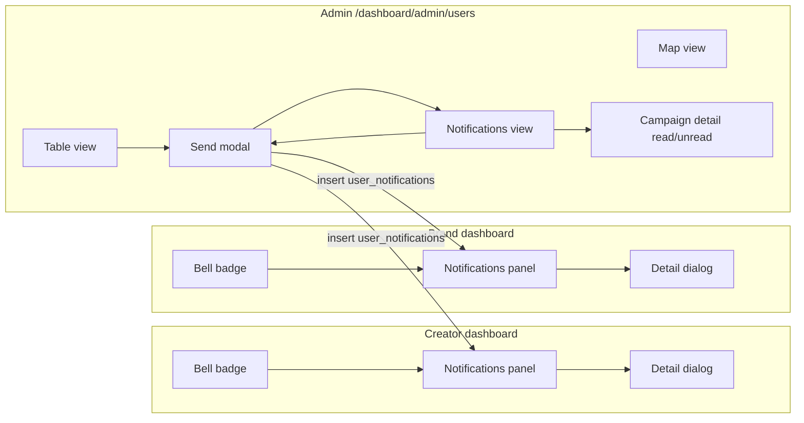

# Admin User Management — Send Notification

**Status:** Planned (not implemented) · **Updated:** May 26, 2026  
**Location:** Admin dashboard → User Management (`/dashboard/admin/users`)

---

## Scope

This document defines only:

- Product / UX behavior
- Notification types (v1: **Public** only)
- Custom message templates with per-recipient variables
- Recipient selection (including **Select all**)
- **Scheduled send** — admin picks date & time; delivery runs at that moment
- Proposed database schema and API contract

**Includes:** UI design by role (admin, creator, brand) — §12.

**Out of scope:** Implemented code (backlog at §11).

---

## 1. Feature summary

Admins compose and send notifications to one or more platform users from **User Management**. Each send is a **campaign** with:

- A chosen **notification type**
- A **message body** (optional `{template variables}`)
- **Table flow:** filter → checkbox select → **Send notification** → modal (type, message, when to send)
- An explicit **recipient list**, or **Select all** matching current table filters (chosen before modal)
- **When to send:** immediately or at a chosen **date and time** (scheduled)

### v1 notification type: Public

- Admin writes free-form copy.
- Copy may include placeholders like `{full_name}`, resolved per recipient at send time.
- **Delivery target:** in-app notification inbox per user (see schema below).
- Users **do not** see the message in their bell inbox until delivery runs (immediate or at `scheduled_at`).

### Scheduled send (v1)

| Choice       | What happens                                                                                 |
| ------------ | -------------------------------------------------------------------------------------------- |
| **Send now** | Fan-out runs right after admin confirms; inbox rows appear within seconds.                   |
| **Schedule** | Campaign saved with `scheduled_at`; status **Scheduled**; cron/worker delivers at that time. |

Template variables (`{full_name}`, `{coins}`, etc.) are resolved **at delivery time**, not when the admin clicks Schedule (so values are fresh when the user receives it).

---

## 2. Admin UI — User Management entry point

**Page:** `/dashboard/admin/users` with three view tabs: **Table** | **Map** | **Notifications** (see §7d, §12.1).

Sending starts on the **Table** view only (not Map). The modal opens **after** filters + selection + button click — not before.

---

### 2.0 Flow — before the modal opens (Table view)

Do these steps **on the users table first**. The **Send notification** modal opens only on step 4.

| Step | Admin action | UI |
|------|--------------|-----|
| **1** | Stay on **Table** view tab (not Map / Notifications) | `[ Table ]` selected |
| **2** | **Apply filters** (optional) | Tab: All / **Creators** / Advertisers / Admins · **[ Filter ]** · search, country, etc. |
| **3** | **Select recipients** | Row ☐ checkboxes and/or **Select all on this page** · **Select all (matching filters)** |
| **4** | Click **[ Send notification ]** | Toolbar / bulk bar — **enabled only if** ≥ 1 recipient (step 3) |
| **5** | Modal opens | **Send notification** dialog (steps A–E below) |

```
Table view
  → Filter (e.g. Creators + US)
  → ☑ users (or Select all matching filters)
  → [ Send notification ]  ← click
  → MODAL opens
```

| Rule | Behavior |
|------|----------|
| No users selected | **Send notification** button **disabled** (greyed out) |
| Map view | No send button; switch to **Table** to send |
| Notifications view | **[ Send notification ]** opens same modal only if selection carried from Table, or show: “Select users on the Table tab first” |

Selection state **persists** when the modal opens: the modal does not ask you to pick users again — it shows a read-only summary (Step C).

---

### 2.1 Send notification modal (opens after §2.0 step 4)

**Title:** Send notification  
**Type:** `Dialog` (or drawer), ~`max-w-lg`

Contents **inside the modal** (admin fills these after the button click):

### Step A — Notification type (required)

| Field   | Value             |
| ------- | ----------------- |
| Label   | Notification type |
| Control | Single-select     |

**Options (v1):**

| Value    | Label  |
| -------- | ------ |
| `public` | Public |

**Reserved for later** (not in v1 UI):

| Value     | Notes                                       |
| --------- | ------------------------------------------- |
| `system`  | Predefined templates, no free-form body     |
| `contest` | Tied to `contest_id`, predefined event copy |

### Step B — Message (required when type = public)

| Field   | Value                                                                                                           |
| ------- | --------------------------------------------------------------------------------------------------------------- |
| Label   | Message                                                                                                         |
| Control | Multiline textarea (min 1 char, max 2000 chars recommended)                                                     |
| Helper  | Use `{variable_name}` for per-user values. Unknown variables are left as literal text in the delivered message. |

**Live preview** (optional but recommended): show resolved message for the first selected user, or a sample user.

### Step C — Recipients (read-only in modal)

Recipients were **already chosen on the table** (§2.0 steps 2–3). The modal only **shows** them — no checkboxes inside the modal.

| UI in modal | Example |
|-------------|---------|
| Summary line | `Sending to 12 user(s) (8 creators, 4 brands)` |
| Mode hint | `Hand-picked selection` or `All matching filters (340 users)` |
| Link (optional) | **Change selection** → closes modal; admin adjusts ☐ on table and clicks **Send notification** again |

If modal opened with zero recipients (edge case) → show error; primary button disabled.

See §4 for `selected_user_ids` vs `select_all_filtered`.

### Step D — When to send (required)

| Field   | Value                                                       |
| ------- | ----------------------------------------------------------- |
| Label   | When to send                                                |
| Control | Radio group + date/time pickers when “Schedule” is selected |

**Options:**

| Value       | UI                     | Behavior                                                  |
| ----------- | ---------------------- | --------------------------------------------------------- |
| `immediate` | **Send now** (default) | Deliver as soon as admin confirms (§10).                  |
| `scheduled` | **Schedule for later** | Show **Date** + **Time** pickers; deliver at that moment. |

**Schedule UI (when `scheduled` selected):**

| Control       | Notes                                                                                           |
| ------------- | ----------------------------------------------------------------------------------------------- |
| Date          | `input type="date"` or calendar — cannot be in the past                                         |
| Time          | `input type="time"` or time picker — combined with date → `scheduled_at`                        |
| Timezone hint | `Times shown in: UTC` or `Local` — same toggle as User Management (`users-management-timezone`) |
| Summary       | `Will send on May 28, 2026 at 9:00 AM (UTC)`                                                    |

**Validation:**

| Rule                                         | Error message (example)                      |
| -------------------------------------------- | -------------------------------------------- |
| `scheduled_at` must be **≥ now + 5 minutes** | “Choose a time at least 5 minutes from now.” |
| `scheduled_at` must be **≤ now + 1 year**    | “Cannot schedule more than 1 year ahead.”    |
| Date + time required when Schedule selected  | “Pick a date and time.”                      |

**Primary button label changes:**

| Mode     | Button                    |
| -------- | ------------------------- |
| Send now | **Send notification**     |
| Schedule | **Schedule notification** |

### Step E — Confirm

| Action    | Label                                                       |
| --------- | ----------------------------------------------------------- |
| Primary   | Send notification **or** Schedule notification (see Step D) |
| Secondary | Cancel                                                      |

**On success — immediate:** toast `Notification sent to N user(s)`; close modal; **View in Notifications**.

**On success — scheduled:** toast `Notification scheduled for May 28, 9:00 AM`; close modal; Notifications tab shows row with status **Scheduled**.

**On partial failure (immediate only):** toast with success + failure counts; show failed IDs in an expandable list (admin-only).

**Cancel scheduled (Notifications tab):** for `status = scheduled` only → **[ Cancel schedule ]** → status `cancelled`; no delivery.

---

## 3. Notification type: `public`

| Property   | Value    |
| ---------- | -------- |
| Enum value | `public` |

### Behavior

- Admin supplies `message_body` (raw template string).
- Server resolves variables per recipient before persisting the delivered copy on each `user_notifications` row (store both template and resolved text — see schema).
- No `contest_id`, no predefined `template_id`.
- Visible in recipient in-app inbox with type badge **Announcement** or **Public** (product copy TBD).

### Validation

- `message_body` trimmed length: `1..2000`
- At least one recipient
- Admin must pass `verifyAdminAccess()`

---

## 4. Recipient selection rules

Exactly **one** mode per send:

### A) `selected_user_ids`

Explicit `UUID[]` from table checkboxes (may span pages if the admin checked rows on multiple pages before opening the modal).

### B) `select_all_filtered`

All users matching the **same filter state** as the User Management table at send time (`user_type`, `is_active`, search query, geo, subscription, etc.).

- Server **must** re-run the filter query and expand to user IDs; do not trust client-provided count alone.
- **Cap (recommended):** reject or batch if recipient count > 10,000; return `400` with message `Too many recipients; narrow filters.`

### C) `select_all_platform` (optional v1)

All active users (`is_active = true`). Prefer **(B)** with empty filters instead of a separate mode.

### Exclusions (always)

- Do not send to users with `is_active = false` unless the admin explicitly includes inactive via filter (default table filter: active only).
- Sending to `user_type = 'admin'` is allowed but should show a confirmation sub-step if any admin is in the recipient set.

### UI: “Select all”

- When clicked, sets mode **B** with current filters.
- Display: `All users matching current filters (N)` where `N` is computed server-side or from a count endpoint.

---

## 5. Custom template variables (`public` type)

**Syntax:** `{snake_case_name}` — case-sensitive, ASCII letters and underscores.

**Resolution:** at send time, for each recipient user row, substitute known keys; leave unknown `{placeholders}` unchanged in the delivered body.

### Supported variables (v1)

Sourced from `public.users`:

| Placeholder       | Source                                                   |
| ----------------- | -------------------------------------------------------- |
| `{user_id}`       | `users.id`                                               |
| `{email}`         | `users.email`                                            |
| `{full_name}`     | `users.full_name`                                        |
| `{username}`      | `users.username` or empty string if null                 |
| `{user_type}`     | `users.user_type` (`creator` \| `advertiser` \| `admin`) |
| `{coins}`         | `users.coins` (stringified integer)                      |
| `{referral_code}` | `users.referral_code` or empty string                    |
| `{created_at}`    | `users.created_at` ISO8601 (user TZ or UTC)              |

### Future variables (not v1)

| Placeholder         | Source                                         |
| ------------------- | ---------------------------------------------- |
| `{company_name}`    | `advertiser_profiles.company_name`             |
| `{total_money_won}` | `creator_profiles.total_money_won` (formatted) |

### Example

**Template:**

```text
Hi {full_name}, your balance is {coins} coins. Thanks for being on GoViral!
```

**Resolved (one user):**

```text
Hi Jane Doe, your balance is 1500 coins. Thanks for being on GoViral!
```

---

## 6. Proposed enums

```sql
create type public.admin_notification_type_enum as enum (
  'public'
  -- Future: 'system', 'contest'
);

create type public.admin_notification_campaign_status_enum as enum (
  'scheduled',  -- waiting until scheduled_at (no user inbox rows yet)
  'pending',    -- immediate send queued; delivery not started
  'processing', -- fan-out in progress
  'completed',  -- all recipients processed
  'partial',    -- some failures
  'failed',     -- campaign aborted or all recipients failed
  'cancelled'   -- admin cancelled before scheduled_at
);
```

---

## 7. Proposed tables

### `admin_notification_campaigns`

Batch metadata for each admin send (audit + idempotency anchor).

```sql
create table public.admin_notification_campaigns (
  id uuid not null default gen_random_uuid(),
  created_by uuid not null,
  notification_type public.admin_notification_type_enum not null,
  message_template text not null,
  recipient_mode text not null,
  filter_snapshot jsonb null,
  recipient_count integer not null default 0,
  success_count integer not null default 0,
  failure_count integer not null default 0,
  status public.admin_notification_campaign_status_enum not null default 'pending',
  scheduled_at timestamp with time zone null,  -- null = send immediately
  timezone_label text null,                 -- e.g. 'UTC' | 'local' (display only, audit)
  error_summary text null,
  created_at timestamp with time zone not null default now(),
  completed_at timestamp with time zone null,
  constraint admin_notification_campaigns_pkey primary key (id),
  constraint admin_notification_campaigns_created_by_fkey
    foreign key (created_by) references public.users (id)
);

create index if not exists idx_admin_notification_campaigns_created_by
  on public.admin_notification_campaigns using btree (created_by);
create index if not exists idx_admin_notification_campaigns_created_at
  on public.admin_notification_campaigns using btree (created_at desc);
create index if not exists idx_admin_notification_campaigns_scheduled_due
  on public.admin_notification_campaigns using btree (scheduled_at)
  where (status = 'scheduled');
```

| Column            | Notes                                                                                                 |
| ----------------- | ----------------------------------------------------------------------------------------------------- |
| `recipient_mode`  | `selected_user_ids` \| `select_all_filtered`                                                          |
| `filter_snapshot` | Copy of User Management filters when mode = `select_all_filtered`                                     |
| `recipient_count` | How many people were targeted when the send finished (see glossary below)                             |
| `scheduled_at`    | **When** users receive the notification. `null` = as soon as possible (immediate). Stored in **UTC**. |
| `timezone_label`  | Which TZ the admin used in the picker (`UTC` / `local`) — for display in audit only                   |

#### Glossary — `scheduled_at`

| Value            | Meaning                                                                          |
| ---------------- | -------------------------------------------------------------------------------- |
| `null`           | **Send now** — worker runs right after create                                    |
| Future timestamp | **Scheduled** — no `user_notifications` until `scheduled_at`; status `scheduled` |

**`created_at`** = when admin clicked Schedule/Send. **`scheduled_at`** = when users should see it. **`completed_at`** = when fan-out finished.

#### Glossary — `recipient_mode`, `filter_snapshot`, `recipient_count`

| Column                | Plain English                                              | Why we store it                                                                                           |
| --------------------- | ---------------------------------------------------------- | --------------------------------------------------------------------------------------------------------- |
| **`recipient_mode`**  | **How** the admin picked who gets the message              | So we know later: “they checked 12 rows” vs “they used Select all with filters.”                          |
| **`filter_snapshot`** | **Which filters** were on screen when they used Select all | So the server can prove who was included (e.g. only Creators in US) and show it in the Notifications tab. |
| **`recipient_count`** | **How many people** were in that send                      | Quick number for the UI (`Sent to 120`) without counting rows every time.                                 |

**`recipient_mode`** — two values only:

| Value                 | Admin did this                              | Example                                         |
| --------------------- | ------------------------------------------- | ----------------------------------------------- |
| `selected_user_ids`   | Checked specific users in the **Table** tab | 12 creators hand-picked                         |
| `select_all_filtered` | Clicked **Select all (matching filters)**   | “All creators” tab + country filter → 340 users |

**`filter_snapshot`** — JSON copy of the Table/Map filters at send time. **Only used when** `recipient_mode = select_all_filtered`. Otherwise `null`.

Example snapshot:

```json
{
  "userType": "creator",
  "isActive": true,
  "search": "",
  "country": "US",
  "filters": []
}
```

If someone asks “why did Jane get this?”, you open the campaign and read the snapshot instead of guessing.

**`recipient_count`** — total targeted users after the server expands the list (selected IDs or filter query). Usually equals rows in `admin_notification_campaign_recipients`. Shown on Notifications tab as **Sent: 120**. Updated when fan-out completes; may differ slightly from `success_count + failure_count` if some rows never delivered.

### `user_notifications`

Per-recipient inbox row (what the user sees).

```sql
create table public.user_notifications (
  id uuid not null default gen_random_uuid(),
  user_id uuid not null,
  campaign_id uuid null,
  notification_type public.admin_notification_type_enum not null,
  title text null,
  message_template text null,
  message_resolved text not null,
  is_read boolean not null default false,
  read_at timestamp with time zone null,
  created_at timestamp with time zone not null default now(),
  constraint user_notifications_pkey primary key (id),
  constraint user_notifications_user_id_fkey
    foreign key (user_id) references public.users (id) on delete cascade,
  constraint user_notifications_campaign_id_fkey
    foreign key (campaign_id) references public.admin_notification_campaigns (id) on delete set null
);

create index if not exists idx_user_notifications_user_id_created_at
  on public.user_notifications using btree (user_id, created_at desc);
create index if not exists idx_user_notifications_user_id_unread
  on public.user_notifications using btree (user_id)
  where (is_read = false);
```

| Column             | Notes                                            |
| ------------------ | ------------------------------------------------ |
| `title`            | v1 public: optional fixed title `"Announcement"` |
| `message_resolved` | Final copy after variable substitution           |

### `admin_notification_campaign_recipients` (optional)

Explicit selected IDs for audit when mode = `selected_user_ids`.

```sql
create table public.admin_notification_campaign_recipients (
  campaign_id uuid not null,
  user_id uuid not null,
  user_type_at_send text not null,  -- creator | advertiser | admin (snapshot at send)
  delivery_status text not null default 'pending',
  error_message text null,
  constraint admin_notification_campaign_recipients_pkey
    primary key (campaign_id, user_id),
  constraint admin_notification_campaign_recipients_campaign_fkey
    foreign key (campaign_id) references public.admin_notification_campaigns (id) on delete cascade,
  constraint admin_notification_campaign_recipients_user_fkey
    foreign key (user_id) references public.users (id) on delete cascade
);
```

`delivery_status`: `pending` \| `delivered` \| `failed`

`user_type_at_send` records **who it was sent to** (brand vs creator) even if the user later changes `user_type`.

---

## 7b. Who was it sent to? (brands vs creators)

There is no separate “brand channel” or “creator channel.” Each send targets **user accounts**; audience is determined by **`users.user_type`** at send time.

### At send time (admin)

| How admin targets audience                                     | What gets stored                                                                                   |
| -------------------------------------------------------------- | -------------------------------------------------------------------------------------------------- |
| Filter User Management by **user type** (creator / advertiser) | `filter_snapshot` on the campaign includes `userType: "creator"` or `"advertiser"`                 |
| Manually check rows                                            | `userIds` list; server resolves each user’s `user_type` into `user_type_at_send` per recipient row |
| Select all with type filter                                    | Only matching users receive a `user_notifications` row                                             |

**Campaign summary (admin UI / API):** for each `campaign_id`, aggregate recipients:

```text
creators:     COUNT(*) WHERE user_type_at_send = 'creator'
brands:       COUNT(*) WHERE user_type_at_send = 'advertiser'   -- advertisers in DB
admins:       COUNT(*) WHERE user_type_at_send = 'admin'
```

Optional breakdown in send modal before confirm: `12 creators, 3 brands` (from current selection or filter count endpoint).

### After send (admin audit)

`GET /api/admin/notifications/campaigns/:campaignId` returns:

| Field                  | Meaning                                    |
| ---------------------- | ------------------------------------------ |
| `recipientCountByType` | `{ creator, advertiser, admin }`           |
| `deliveredCount`       | Rows with `delivery_status = delivered`    |
| `readCount`            | Recipients with `is_read = true` (see §7c) |
| `readCountByType`      | Read counts split by `user_type_at_send`   |

Query pattern (definitions):

```sql
-- Who got it (brands vs creators)
select user_type_at_send, count(*)
from admin_notification_campaign_recipients
where campaign_id = :id and delivery_status = 'delivered'
group by user_type_at_send;
```

---

## 7c. Did they read the message?

Read state lives on **`user_notifications`** per user, not on the campaign alone.

| Column    | When set                                                       |
| --------- | -------------------------------------------------------------- |
| `is_read` | `false` on insert; `true` when the user opens the notification |
| `read_at` | Timestamp of first open (do not clear on re-open)              |

### When counts as “read”

Mark read only when the user **explicitly opens** the notification (inbox list click or detail view), via:

`PATCH /api/notifications/:id/read` with `user_id = auth.uid()`.

Do **not** mark read on:

- Bell badge render
- List row visible in viewport without click
- Email/push preview (future channels)

### Admin: read rate per campaign

Join campaign recipients to inbox rows:

```sql
select
  r.user_type_at_send,
  count(*) filter (where n.is_read) as read_count,
  count(*) as sent_count
from admin_notification_campaign_recipients r
join user_notifications n
  on n.campaign_id = r.campaign_id and n.user_id = r.user_id
where r.campaign_id = :id
  and r.delivery_status = 'delivered'
group by r.user_type_at_send;
```

**Admin campaign detail UI (recommended):** see **§7d** for full per-creator / per-brand table.

### User-facing (creator / brand)

- Inbox: `/dashboard` notification bell → list of `user_notifications` for `auth.uid()`
- Unread badge: `count(*) where is_read = false`
- Same inbox for **creators** and **advertisers**; only the logged-in user’s rows are visible (RLS)

### What you cannot know (v1)

- Push/email open tracking (not in v1)
- “Seen in passing” without opening the item
- Read state if the user never logs in (stays `is_read = false`)

---

## 7d. Admin UI — show if each creator (or brand) read or not

Read/unread is **not** on the **Table** view (that view is for browsing users and sending). It lives on the third **Notifications** view tab on the same User Management page (next to **Table** and **Map**).

### View tabs on `/dashboard/admin/users`

Same page, one route. Toggle in the header (matches existing Table / Map control):

```
[ Table ] [ Map ] [ Notifications ]
```

| View              | Purpose                                                    |
| ----------------- | ---------------------------------------------------------- |
| **Table**         | User list, filters, checkboxes, **[ Send notification ]**  |
| **Map**           | Geo map of users (unchanged)                               |
| **Notifications** | Past campaigns + per-creator / per-brand **Read / Unread** |

`viewMode`: `"table"` \| `"map"` \| `"notifications"`

Optional: persist last `viewMode` in `localStorage` (same pattern as `users-management-timezone`).

### Notifications tab — two levels

**Level 1 — Campaign list** (default when opening Notifications tab)

| When                            | Message         | Audience     | Read  | Status                   |
| ------------------------------- | --------------- | ------------ | ----- | ------------------------ |
| May 25, 2:30 PM (sent)          | Hi {full_name}… | 80 creators  | 30/80 | Completed                |
| **May 28, 9:00 AM** (scheduled) | Hi {full_name}… | 120 creators | —     | **Scheduled** · [Cancel] |

- Toolbar: **[ Send notification ]** (opens same send modal; switches to **Table** tab optional after send, or stay and refresh list)
- Row click → **Level 2** (campaign detail) inline below list or full-width replace list

**Level 2 — Campaign detail** (drill-down inside Notifications tab)

Back link: `← All notifications`

### Summary cards (top of campaign detail)

```
┌─────────────┐ ┌──────────────────┐ ┌─────────────────────┐
│ Sent: 80    │ │ Read: 30 (37.5%) │ │ Creators: 30/80 read│
└─────────────┘ └──────────────────┘ └─────────────────────┘
```

- **Creators: 30/80 read** = of everyone sent with `user_type_at_send = creator`, 30 have `is_read = true`.
- If the campaign included brands, add **Brands: 15/40 read**.

### Recipient table (per creator / per brand)

Filter tabs: **All** | **Creators** | **Brands** | **Unread only**

| Name       | Email  | Type    | Delivered   | Read status | Read at         |
| ---------- | ------ | ------- | ----------- | ----------- | --------------- |
| Jane Doe   | jane@… | Creator | ✓ Delivered | **Read**    | May 25, 3:42 PM |
| John Smith | john@… | Creator | ✓ Delivered | **Unread**  | —               |
| Acme Inc   | biz@…  | Brand   | ✓ Delivered | **Read**    | May 25, 4:01 PM |

**Read status column (UI):**

| `is_read` | Badge      | Color (example)              |
| --------- | ---------- | ---------------------------- |
| `false`   | **Unread** | Amber / orange outline       |
| `true`    | **Read**   | Green outline or muted green |

Optional: icon — `MailOpen` = read, `Mail` = unread.

**Read at:** show `read_at` in admin timezone (same toggle as User Management UTC/local); `—` if unread.

**Delivered:** from `admin_notification_campaign_recipients.delivery_status`; failed rows show **Failed** (red), not read/unread.

### API payload for the table

`GET /api/admin/notifications/campaigns/:campaignId?tab=creators&readFilter=unread`

```json
{
  "campaign": {
    "id": "...",
    "messageTemplate": "Hi {full_name}...",
    "createdAt": "..."
  },
  "summary": {
    "sent": 80,
    "read": 30,
    "readPercent": 37.5,
    "byType": {
      "creator": { "sent": 80, "read": 30 },
      "advertiser": { "sent": 0, "read": 0 }
    }
  },
  "recipients": [
    {
      "userId": "uuid",
      "fullName": "Jane Doe",
      "email": "jane@example.com",
      "userTypeAtSend": "creator",
      "deliveryStatus": "delivered",
      "isRead": true,
      "readAt": "2026-05-25T15:42:00Z",
      "sentAt": "2026-05-25T14:00:00Z"
    },
    {
      "userId": "uuid",
      "fullName": "John Smith",
      "email": "john@example.com",
      "userTypeAtSend": "creator",
      "deliveryStatus": "delivered",
      "isRead": false,
      "readAt": null,
      "sentAt": "2026-05-25T14:00:00Z"
    }
  ]
}
```

Server joins `admin_notification_campaign_recipients` → `user_notifications` on `campaign_id` + `user_id` to fill `isRead` / `readAt`.

### Filtering to “which creators have not read?”

1. Open **Notifications** view tab.
2. Click the campaign row.
3. Sub-tabs on detail: **All** \| **Creators** \| **Brands** \| **Unread only**.
4. Optional **Export CSV**: `email, full_name, read_status, read_at`.

### After send (from Table tab)

Success toast includes **View in Notifications** → sets `viewMode = "notifications"` and selects the new `campaignId` in detail view.

### What admin cannot see on this screen

- Whether they **opened** the bell without clicking the message (still **Unread**).
- Read status before send completes (row appears after `delivery_status = delivered`).
- Read stats for **scheduled** campaigns until `scheduled_at` passes (shows **Scheduled** / “Not sent yet” on recipient rows).

---

## 8. API contract (definitions only)

### `POST /api/admin/notifications/send`

- **Auth:** admin only (`verifyAdminAccess`)

**Request body:**

```json
{
  "notificationType": "public",
  "messageBody": "Hi {full_name}, ...",
  "recipientMode": "selected_user_ids",
  "userIds": ["uuid"],
  "filters": {},
  "sendTiming": "immediate",
  "scheduledAt": null,
  "timezoneLabel": "UTC"
}
```

| Field         | Required when                             |
| ------------- | ----------------------------------------- |
| `userIds`     | `recipientMode = selected_user_ids`       |
| `filters`     | `recipientMode = select_all_filtered`     |
| `scheduledAt` | ISO8601 UTC when `sendTiming = scheduled` |
| `sendTiming`  | `immediate` (default) \| `scheduled`      |

**Response `200` — immediate:**

```json
{
  "campaignId": "uuid",
  "recipientCount": 120,
  "successCount": 118,
  "failureCount": 2,
  "status": "partial",
  "scheduledAt": null
}
```

**Response `200` — scheduled:**

```json
{
  "campaignId": "uuid",
  "recipientCount": 120,
  "successCount": 0,
  "failureCount": 0,
  "status": "scheduled",
  "scheduledAt": "2026-05-28T09:00:00.000Z"
}
```

**Errors:** `400` validation · `403` non-admin · `413` too many recipients

### Other endpoints

| Method  | Path                                                | Purpose                                                                                       |
| ------- | --------------------------------------------------- | --------------------------------------------------------------------------------------------- |
| `GET`   | `/api/admin/notifications/campaigns?limit=&offset=` | List past sends (admin audit)                                                                 |
| `GET`   | `/api/admin/notifications/campaigns/:campaignId`    | Per-recipient `isRead` / `readAt`; query: `userType=creator\|advertiser`, `readFilter=unread` |
| `PATCH` | `/api/admin/notifications/campaigns/:id/cancel`     | Cancel scheduled campaign (`status → cancelled`)                                              |
| `GET`   | `/api/notifications`                                | User inbox (future)                                                                           |
| `PATCH` | `/api/notifications/:id/read`                       | Mark read (future)                                                                            |

---

## 9. RLS / security

### `admin_notification_campaigns`

- `SELECT` / `INSERT`: admin role only
- No `UPDATE` / `DELETE` for admins except status fields via service role during fan-out

### `user_notifications`

- `SELECT`: `user_id = auth.uid()`
- `UPDATE is_read`: `user_id = auth.uid()`
- `INSERT`: service role / admin API only (never client-side insert)

### Rate limits (recommended)

- Max **3** campaigns per admin per minute
- Max **10,000** recipients per campaign

---

## 10. Fan-out / delivery

### Immediate send (`scheduled_at` is null)

1. Admin confirms → campaign `status = pending` (or `processing`).
2. Expand recipients → write `admin_notification_campaign_recipients`.
3. Resolve `{variables}` **now** → insert `user_notifications` → `created_at` ≈ now.
4. Update `recipient_count`, `success_count`, `failure_count`, `status`, `completed_at`.

**Synchronous** if recipient count ≤ 500; **async job** if > 500 (same as before).

### Scheduled send (`scheduled_at` is set)

1. Admin confirms → campaign `status = scheduled`, `scheduled_at` = chosen time.
2. Expand recipients **now** (so admin sees count and can cancel); `delivery_status = pending` on recipient rows.
3. **Do not** insert `user_notifications` yet.
4. **Scheduler** (QStash `notBefore` at `scheduled_at` per campaign; Vercel cron daily sweep as backup):

```sql
select id from admin_notification_campaigns
where status = 'scheduled'
  and scheduled_at <= now()
order by scheduled_at
limit 50;
```

5. For each due campaign: `status = processing` → resolve variables **at this moment** → insert `user_notifications` (`created_at` = now) → update counts → `completed` \| `partial`.

### Cancel before due time

- `PATCH /api/admin/notifications/campaigns/:id/cancel`
- Only if `status = scheduled` and `scheduled_at > now()`
- Set `status = cancelled`; recipient rows stay audit-only; never create inbox rows

### Idempotency

Client may send `Idempotency-Key` header; duplicate within 24h returns same `campaignId` without double delivery.

Scheduler must use row lock / `status = processing` so the same campaign is not delivered twice.

---

## 12. UI design by role

Creators and brands **share the same notification inbox UI** (bell, dropdown, detail). Only the **dashboard shell** (sidebar links, profile sheet extras) differs by `user_type`. Admin has a **separate** compose + audit experience on User Management.

### Shared design system

| Element    | Pattern                                                                                          |
| ---------- | ------------------------------------------------------------------------------------------------ |
| Components | Existing shadcn: `Dialog`, `Sheet`, `Button`, `Badge`, `Table`, `Checkbox`, `Select`, `Textarea` |
| Theme      | Same `ClientLayout` light/dark + purple accent as rest of dashboard                              |
| Icons      | `Bell` (inbox), `Megaphone` or `Mail` (announcement type), `Send` (admin send)                   |

---

### 12.1 Admin UI

**Single route:** `/dashboard/admin/users` — three **view** tabs (not separate pages).

| View tab          | Icon                  | Content                                 |
| ----------------- | --------------------- | --------------------------------------- |
| **Table**         | `List`                | Users grid + send (§2)                  |
| **Map**           | `Map`                 | Users map (existing)                    |
| **Notifications** | `Bell` or `Megaphone` | Campaign list + read/unread audit (§7d) |

**Layout — header (all views)**

```
┌──────────────────────────────────────────────────────────────────────────┐
│ Users Management    [ Sticky □ ] [ Table | Map | Notifications ] [Filter]…│
└──────────────────────────────────────────────────────────────────────────┘
```

Switching view hides the other body; **user-type tabs** (All / Creators / Advertisers / Admins) apply only to **Table** and **Map**, not to Notifications.

---

**View — Table** (send flow — §2.0)

```
├─────────────────────────────────────────────────────────────────┤
│ [ Filter ] ...                                                   │
│ Tabs: All | Creators | Advertisers | Admins                     │
│ ☐ Select all on page    ☐ Select all (filtered)  [Send notif.] │  ← disabled if none selected
├─────────────────────────────────────────────────────────────────┤
│ ☑ │ Jane      │ j@...        │ creator   │ ...                  │
└─────────────────────────────────────────────────────────────────┘
        │  Filter → ☐ → click [ Send notification ]
        ▼
   Modal §2.1
```

| Control                            | Behavior                                                                                |
| ---------------------------------- | --------------------------------------------------------------------------------------- |
| **[ Filter ]**                     | Narrows rows; used with **Select all (filtered)**                                       |
| Tab **Creators** / **Advertisers** | `user_type` filter + filter snapshot on send                                            |
| Row ☐ / Select all                 | Choose recipients **before** modal opens                                                |
| **Send notification**              | **Opens modal** (§2.1); disabled until ≥ 1 recipient selected                           |

---

**View — Map** (existing)

Unchanged. No notification send/read on map.

---

**View — Notifications** (new)

```
├─────────────────────────────────────────────────────────────────┤
│ [ Send notification ]                              [ Export CSV ]│
├─────────────────────────────────────────────────────────────────┤
│  LEVEL 1: Campaign list                                         │
│  When            │ Message            │ Read        │ Status      │
│  May 25 (sent)   │ Hi {full_name}...  │ 30/80       │ Completed   │
│  May 28 9am (sch)│ Hi {full_name}...  │ —           │ Scheduled ⓧ │
├─────────────────────────────────────────────────────────────────┤
│  LEVEL 2 (after row click): ← All notifications                 │
│  [ Sent 120 ] [ Read 45 (37%) ] [ Creators 30/80 ] [ Brands … ] │
│  Sub-tabs: All | Creators | Brands | Unread only                  │
│  Name     │ Email   │ Type    │ Read status │ Read at            │
│  Jane Doe │ jane@…  │ Creator │ Read        │ May 25, 3:42 PM    │
│  John …   │ john@…  │ Creator │ Unread      │ —                  │
└─────────────────────────────────────────────────────────────────┘
```

| Control               | Behavior                                                                                   |
| --------------------- | ------------------------------------------------------------------------------------------ |
| Campaign row click    | Opens Level 2 detail (same tab, no route change)                                           |
| **Creators** sub-tab  | Only `user_type_at_send = creator`                                                         |
| **Unread only**       | Only `is_read = false`                                                                     |
| **Send notification** | Same modal as Table view; after send, refresh list and optional drill-down to new campaign |

**Modal — opens only after §2.0** (Filter → ☐ → **[ Send notification ]**)

```
┌ Send notification ──────────────────────────────── ✕ ┐
│ Recipients (from table — read-only)                  │
│   Sending to 12 users (8 creators, 4 brands)        │
│                                                      │
│ Notification type    [ Public ▼ ]                   │
│ Message + variables + preview                        │
│ When to send: ○ Send now  ○ Schedule + date/time    │
│                                                      │
│        [ Cancel ]  [ Send notification ]             │
└──────────────────────────────────────────────────────┘
```

| Step         | UI                                                                                      |
| ------------ | --------------------------------------------------------------------------------------- |
| Recipients   | **Read-only** at top — from table ☐ (§2.0 step 3); optional **Change selection**      |
| Type         | `Select` → only **Public** in v1                                                        |
| Message      | `Textarea` + variable chips + preview                                                   |
| When to send | Radio **Send now** / **Schedule** + date + time (§2 Step D)                             |
| Confirm      | **Send notification** or **Schedule notification**                                      |

**Modal — Send result**

| Result              | UI                                                                            |
| ------------------- | ----------------------------------------------------------------------------- |
| Success (now)       | Green toast + **View in Notifications**                                       |
| Success (scheduled) | Blue toast: “Scheduled for May 28, 9:00 AM” + Notifications tab               |
| Partial             | Amber toast: “118 sent, 2 failed” + expandable failed emails (immediate only) |

Campaign detail is **Level 2 inside Notifications view** (§7d), not a separate route.

Admin **does not** use the creator/brand header bell inbox; they use **Notifications** view tab for audit.

---

### 12.2 Creator UI (receive)

**Shell:** `/dashboard/*` with `user_type = creator` — existing sidebar (Opportunities, Submissions, Earnings, etc.).

Scheduled admin sends: nothing in the bell until `scheduled_at`; then the row appears like any other notification.

**Entry — header bell** (add to `ClientLayout` top bar, right cluster near profile)

```
                    [ 🔔 3 ]  [ Avatar ▼ ]
```

| State     | UI                                                  |
| --------- | --------------------------------------------------- |
| No unread | Bell icon only, no badge                            |
| Unread    | Purple/red dot or numeric badge `1–99`, `99+` cap   |
| Click     | Opens **Notifications panel** (not full page in v1) |

**Panel — dropdown or `Sheet` (right side, `w-96`)**

```
┌ Notifications ──────────────── Mark all read ┐
│ [ All ] [ Unread ]                            │
├───────────────────────────────────────────────┤
│ ● Announcement                    2h ago      │
│   Hi Jane, your balance is 1500 coins...      │
├───────────────────────────────────────────────┤
│ ○ Announcement                    Yesterday   │
│   New contest guidelines...                   │
├───────────────────────────────────────────────┤
│            View all notifications →          │  (optional /notifications page)
└───────────────────────────────────────────────┘
```

| Row       | Design                                              |
| --------- | --------------------------------------------------- |
| Unread    | Bold title, `●` dot, slightly tinted row background |
| Read      | Muted text, no dot                                  |
| Badge     | **Announcement** (v1 public admin sends)            |
| Snippet   | First ~80 chars of `message_resolved`               |
| Click row | Opens **detail** + calls mark-read API              |

**Detail — `Dialog` or inline expand**

```
┌ Announcement ───────────────────────── ✕ ┐
│ May 25, 2026 · 2:15 PM                     │
│                                            │
│ Hi Jane Doe, your balance is 1500 coins.   │
│ Thanks for being on GoViral!               │
│                                            │
│                              [ Close ]     │
└────────────────────────────────────────────┘
```

| Action        | Behavior                                                   |
| ------------- | ---------------------------------------------------------- |
| Open detail   | `PATCH .../read` → `is_read = true`, badge count decreases |
| Mark all read | Batch PATCH for all unread ids                             |

**Empty state**

```
No notifications yet
We'll let you know about contests, earnings, and updates here.
```

**Mobile:** Same bell in collapsed header; panel = full-width `Sheet` from bottom or right.

Creators see **only their** rows (RLS). Copy is already personalized (`message_resolved`).

---

### 12.3 Brand UI (receive)

**Shell:** `/dashboard/*` with `user_type = advertiser` — sidebar (Contests, Billing, etc.).

**Notification UI is identical to §12.2** (same bell, same panel, same detail, same APIs).

| Difference        | Creator                               | Brand                            |
| ----------------- | ------------------------------------- | -------------------------------- |
| Sidebar nav       | Creator links                         | Brand links                      |
| Profile sheet     | Account switcher, creator badge       | “Current Plan” card, Brand badge |
| Notification rows | Same layout                           | Same layout                      |
| Data              | `user_notifications` for `auth.uid()` | Same table, own `user_id`        |

Brands do **not** get a different message design in v1; only the **resolved text** differs per user (e.g. `{company_name}` when added later).

**Empty state (brand)** — same component, optional copy tweak:

```
No notifications yet
Announcements about billing, contests, and platform updates will appear here.
```

---

### 12.4 Side-by-side summary



| Role    | Can send? | Can read inbox?                 | Primary surfaces                                  |
| ------- | --------- | ------------------------------- | ------------------------------------------------- |
| Admin   | Yes       | No (audit in Notifications tab) | Table + Map + **Notifications** views, send modal |
| Creator | No        | Yes                             | Header bell → panel → detail                      |
| Brand   | No        | Yes                             | Header bell → panel → detail (same as creator)    |

---

### 12.5 Settings overlap

Existing **Settings › Notifications** (email/push toggles) is **separate** from this in-app inbox:

| Settings toggles           | Admin public inbox                       |
| -------------------------- | ---------------------------------------- |
| Future email/push delivery | v1 in-app only                           |
| User preference            | Always stored; admin send ignores for v1 |

Do not hide in-app announcements when email notifications are off.

---

## 11. Implementation backlog

- [ ] Table flow: Filter → ☐ select → **Send notification** opens modal (§2.0); button disabled if none selected
- [ ] **Send notification** button on `/dashboard/admin/users` Table toolbar
- [ ] Modal with notification type select (Public)
- [ ] Message textarea + variable helper list
- [ ] Wire table checkboxes + Select all (filtered) to recipient payload
- [ ] Recipient count preview before send
- [ ] Admin toast + error handling per §2 Step E
- [ ] **When to send:** Send now vs Schedule + date/time pickers (`scheduled_at`, §2 Step D)
- [ ] Scheduler cron/worker for `status = scheduled` and `scheduled_at <= now()` (§10)
- [ ] Cancel scheduled campaign (API + Notifications tab)
- [ ] Admin: third view tab **Notifications** next to Table / Map (`viewMode` + UI)
- [ ] Notifications tab: campaign list + drill-down read/unread table (§7d)
- [ ] Creator + brand: header bell + panel + detail (§12.2–12.3, shared component)
- [ ] Mark all read + unread filter sub-tabs on campaign detail
- [ ] (Later) Additional notification types: `system`, `contest`
