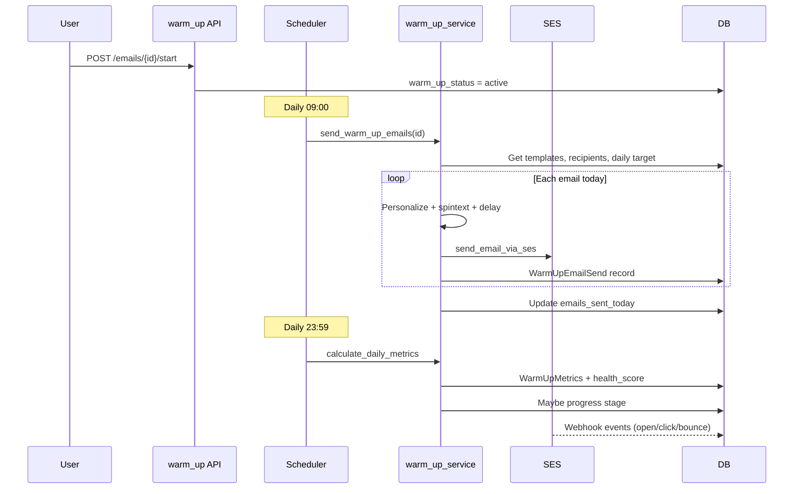

# Email Warm-Up — Implementation Guide

This document describes how the **Email Warm-Up** feature works end-to-end: architecture, database schema, scheduling, sending, health scoring, API surface, and frontend integration.

The dashboard UI (`/dashboard/warm-up`) shows sender accounts with status, health score, daily send limits, and warmup mail counts — matching the data returned by the warm-up APIs.

---

## Overview

Email warm-up gradually increases sending volume for new or cold sender addresses so inbox providers (Gmail, Outlook, etc.) build trust before full campaign outreach.

**Goals:**
- Send low-volume, human-like emails to trusted recipients
- Track delivery, opens, clicks, bounces, and complaints via SES events
- Compute a **health score** (0–100) per sender
- Progress through **stages** (Foundation → Growth → Expansion → Ready)
- Separate **warm-up sends** from **campaign sends** (different daily counters)

---

## Architecture

```
┌─────────────────────────────────────────────────────────────────────────┐
│                         Frontend (persist-wizard)                        │
│  /dashboard/warm-up  →  apiService (warm-up/* endpoints)                │
└───────────────────────────────────┬─────────────────────────────────────┘
                                    │ HTTP /api/warm-up/*
┌───────────────────────────────────▼─────────────────────────────────────┐
│  backend/routers/warm_up.py          — CRUD, start/pause, manual send   │
│  backend/routers/warm_up_admin.py    — admin triggers (metrics, health) │
│  backend/routers/email_queue.py      — project-level warm-up status     │
└───────────────────────────────────┬─────────────────────────────────────┘
                                    │
┌───────────────────────────────────▼─────────────────────────────────────┐
│  backend/services/warm_up_service.py     — core business logic          │
│  backend/services/warm_up_scheduler.py   — cron-like daily automation   │
└───────────────────────────────────┬─────────────────────────────────────┘
                                    │
          ┌─────────────────────────┼─────────────────────────┐
          ▼                         ▼                         ▼
   AWS SES (send)          SES Event Handler          MySQL (models)
   email_service            ses_event_handler          warm_up_*
```

**Startup:** `backend/main.py` starts `warm_up_scheduler` on app boot **only when** `DEVELOPMENT_MODE=False` in `.env`. In local dev (`DEVELOPMENT_MODE=True`), the scheduler is skipped — use manual send or admin endpoints to test.

---

## Database Models

All models live in `backend/models/warm_up.py`.

### `WarmUpEmail` — sender account being warmed

| Column | Purpose |
|--------|---------|
| `email`, `first_name`, `last_name` | Sender identity |
| `warm_up_status` | `pending`, `active`, `paused`, `completed`, `failed` |
| `current_stage` | `foundation`, `growth`, `expansion`, `ready` |
| `daily_limit` | Max warm-up emails/day for current stage |
| `emails_sent_today` | Warm-up counter (resets midnight UTC) |
| `total_emails_sent` | Lifetime warm-up sends |
| `campaign_daily_limit` / `campaign_sent_today` | **Separate** limits for real campaigns |
| `current_health_score` / `best_health_score` | 0–100 deliverability health |
| `is_ready_for_sending` | User marks account ready for campaigns after warm-up |
| `inbox_landing_status`, `spam_score`, `deliverability_flags` | SES-derived deliverability |
| `start_date`, `target_completion_date` | ~21-day warm-up window |

### `WarmUpEmailSend` — individual send record

Tracks each outbound warm-up email: recipient, subject, body, template, `message_id`, delivery/open/click/reply/bounce flags, per-send deliverability scores.

### `WarmUpMetrics` — daily rollup per sender

Aggregates sends per day: volumes, rates (delivery, open, reply, bounce, complaint), `health_score`, `stage_progression_triggered`.

### `WarmUpRecipient` — who receives warm-up mail

Project-scoped list of internal/test recipients. Ordered by least-used when selecting next recipient.

### `WarmUpTemplate` — email content

Subject/body with placeholders and **spintext** (`{Hi|Hello}`). 20+ default templates seeded per user on first warm-up account creation.

### `WarmUpVerifiedEmail` — verified sender addresses

Links verified project emails to warm-up accounts. SES domain verification can skip per-email verification when the address is on a verified domain.

---

## Warm-Up Stages

Configured in `WarmUpService._get_stage_configuration()` (`warm_up_service.py`):

| Stage | Duration | Daily limit | Progression criteria (examples) |
|-------|----------|-------------|----------------------------------|
| **Foundation** | Days 1–7 | 10/day | delivery ≥95%, open ≥15%, bounce ≤5% |
| **Growth** | Days 8–14 | 25/day | delivery ≥97%, open ≥20%, bounce ≤3% |
| **Expansion** | Days 15–21 | 45/day | delivery ≥98%, open ≥25%, bounce ≤2% |
| **Ready** | Complete | 100/day cap | Warm-up marked `completed` |

Stage progression runs during **daily metrics calculation** (`calculate_daily_metrics`) when criteria are met and minimum send counts are satisfied.

---

## End-to-End Flow

### 1. Setup (user)

1. **Verify domain** on the project (SES domain verification required for sending).
2. Add **verified sender emails** (`WarmUpVerifiedEmail`) via sender management UI.
3. Create a **warm-up account**:
   - `POST /api/warm-up/emails/` — manual IMAP-style config (legacy fields kept)
   - `POST /api/warm-up/emails/from-verified/{verified_email_id}` — **recommended** path from verified email
4. Add **recipients** (`POST /api/warm-up/recipients/` or bulk).
5. Default **templates** are auto-created for the user if none exist.

### 2. Start warm-up

`POST /api/warm-up/emails/{id}/start`

- Sets `warm_up_status = active`
- Sets `start_date`, `current_stage = foundation`, `daily_limit` from stage config
- Scheduler picks up active accounts on the next daily run

**Pause / Resume:**
- `POST .../pause` → `warm_up_status = paused`
- `POST .../resume` → `warm_up_status = active`

### 3. Automated daily sending (scheduler)

`WarmUpScheduler` (`warm_up_scheduler.py`):

| Schedule | Job |
|----------|-----|
| Daily 09:00 | `send_daily_warm_up_emails` — schedule per-account send times |
| Daily 00:00 UTC | `reset_daily_counters` — `emails_sent_today = 0`, `campaign_sent_today = 0` |
| Daily 23:59 | `calculate_daily_metrics` — health scores + stage progression |
| Every hour | `check_warm_up_health` — log low health, reset stuck counters |
| On startup | `_run_startup_recovery` — catch missed sends after server restart |

For each **active** `WarmUpEmail`:
1. Compute random send time within project email window (default 09:00–17:00 IST).
2. Add per-account minute offset (hash-based) to avoid simultaneous bursts.
3. At scheduled time → `warm_up_service.send_warm_up_emails(warm_up_email_id)`.

### 4. What `send_warm_up_emails` does

(`warm_up_service.py` → `send_warm_up_emails`)

1. **Daily target** — `_get_daily_send_target_for_today()`:
   - Varies count per day (70–120% of stage cap, deterministic by date + email id)
   - Ramps first 7 days from ~50% to 100%
   - Capped by project `daily_email_limit`
2. Load active **templates** and **recipients** (least-used first).
3. For each email to send today:
   - Pick random template + next recipient (rotate if fewer recipients than sends).
   - **Delay 2–6 minutes** between sends (anti-spam burst protection).
   - Personalize: `{first_name}`, `{from_name}`, `{company}`, industry spintext vars.
   - Resolve spintext: `{Hi|Hello}` → random choice.
   - Send via **AWS SES** (`_send_via_ses` → `email_service.send_email_via_ses`).
   - Create `WarmUpEmailSend` row with `message_id`.
4. Update `emails_sent_today`, `total_emails_sent`, `last_send_date`.

### 5. Manual send (UI: "Send Warm-Up Email")

`POST /api/warm-up/emails/{id}/send-manual`

- User picks template, recipients, optional custom subject/body.
- Respects `daily_limit`; uses shorter delays (2–4 seconds) for API responsiveness.
- Same SES path and send record creation.

### 6. Event tracking (opens, clicks, bounces)

SES webhooks → `ses_event_handler.py` updates:
- `WarmUpEmailSend` — `opened_at`, `clicked_at`, `is_bounced`, etc.
- `WarmUpEmail` — aggregate deliverability scores
- `WarmUpMetrics` — daily counters via `calculate_daily_metrics`
- `WarmUpRecipient` — `emails_received`, `engagement_score`

### 7. Health score

`_calculate_health_score()`:

```
health = (delivery_rate × 0.4) + (open_rate × 0.35) + (reputation × 0.25)
reputation = max(0, 100 - bounce_rate - complaint_rate × 100)
```

Displayed in the UI as **Health %** (e.g. 29%, 31%).

### 8. Mark ready for campaigns

After warm-up completes (`warm_up_status = completed`, stage `ready`):

`POST /api/warm-up/emails/{id}/mark-ready` → `is_ready_for_sending = true`

Campaign sending can then use these senders. Warm-up and campaign counters remain **separate** (`emails_sent_today` vs `campaign_sent_today`).

---

## API Reference

Base prefix: `/api/warm-up`

### Sender accounts

| Method | Path | Description |
|--------|------|-------------|
| POST | `/emails/` | Create warm-up account |
| POST | `/emails/from-verified/{verified_email_id}` | Create from verified email |
| GET | `/emails/?project_id=` | List accounts (dashboard table) |
| GET | `/emails/{id}` | Get one account |
| PUT | `/emails/{id}` | Update account |
| DELETE | `/emails/{id}` | Delete account |
| POST | `/emails/{id}/start` | Start warm-up |
| POST | `/emails/{id}/pause` | Pause |
| POST | `/emails/{id}/resume` | Resume |
| GET | `/emails/{id}/status` | Status + metrics summary |
| POST | `/emails/{id}/send-manual` | Manual warm-up send |
| POST | `/emails/{id}/send-test` | Test send |
| POST | `/emails/{id}/mark-ready` | Mark ready for campaigns |
| POST | `/emails/{id}/mark-not-ready` | Unmark ready |
| POST | `/emails/{id}/recover-from-junk` | Reduce volume after spam placement |
| GET | `/emails/{id}/metrics` | Daily metrics history |
| GET | `/emails/{id}/daily-stats` | Chart data |
| GET | `/emails/{id}/sidebar-details` | Detail panel data |
| GET | `/emails/{id}/sends` | Individual send log |
| GET | `/emails/ready-for-sending` | Completed + ready accounts |

### Recipients

| Method | Path | Description |
|--------|------|-------------|
| POST | `/recipients/` | Add recipient |
| POST | `/recipients/bulk` | Bulk add |
| GET | `/recipients/?project_id=` | List |
| PUT/DELETE | `/recipients/{id}` | Update / delete |

### Templates

| Method | Path | Description |
|--------|------|-------------|
| GET/POST | `/templates/` | List / create |
| GET/PUT/DELETE | `/templates/{id}` | CRUD |

### Analytics

| Method | Path | Description |
|--------|------|-------------|
| GET | `/analytics/overview?project_id=` | Summary cards (total, healthy, warming, paused) |
| GET | `/analytics/health-scores?project_id=` | Health scores list |

### Admin (`/api/warm-up/admin`)

| Method | Path | Description |
|--------|------|-------------|
| POST | `/reset-daily-counters` | Force midnight reset |
| POST | `/calculate-metrics` | Force metrics run |
| POST | `/check-health` | Force health check |

### Project-level (`/api/email-queue`)

| Method | Path | Description |
|--------|------|-------------|
| POST | `/{project_id}/start-warm-up` | Project warm-up flag |
| GET | `/{project_id}/warm-up-status` | Project warm-up state |

---

## Frontend Files

| File | Role |
|------|------|
| `persist-wizard/src/app/dashboard/warm-up/page.tsx` | Main dashboard (table, stats, start/pause) |
| `persist-wizard/src/components/warm-up-email-details.tsx` | Account detail sidebar |
| `persist-wizard/src/components/warm-up-analytics.tsx` | Analytics charts |
| `persist-wizard/src/components/warm-up-templates.tsx` | Template management |
| `persist-wizard/src/components/warm-up-recipients.tsx` | Recipient management |
| `persist-wizard/src/components/manual-warm-up-send.tsx` | "Send Warm-Up Email" dialog |
| `persist-wizard/src/components/daily-stats-modal.tsx` | Per-day stats modal |
| `persist-wizard/src/components/sender-email-management.tsx` | Verified sender management |
| `persist-wizard/src/lib/api.ts` | `apiService.getWarmUpEmails`, `sendManualWarmUpEmails`, etc. |

### Dashboard columns (from API)

| UI column | API field |
|-----------|-----------|
| User (email) | `email`, `first_name`, `last_name` |
| Status | `warm_up_status` → Active / Paused |
| Health % | `current_health_score` |
| Email Sent | `campaign_sent_today` of `campaign_daily_limit` |
| Warmup Mails | `emails_sent_today` of `daily_limit` |
| Flame icon | Start / pause warm-up actions |

---

## Backend Files

| File | Role |
|------|------|
| `backend/models/warm_up.py` | All warm-up DB models |
| `backend/services/warm_up_service.py` | Templates, sending, metrics, stages |
| `backend/services/warm_up_scheduler.py` | Automated scheduling |
| `backend/routers/warm_up.py` | REST API |
| `backend/routers/warm_up_admin.py` | Admin triggers |
| `backend/services/ses_event_handler.py` | Open/click/bounce tracking for warm-up sends |
| `backend/services/email_service.py` | SES send (`send_email_via_ses`) |
| `backend/main.py` | Router registration + scheduler startup |

---

## Template Variables & Spintext

**Placeholders** (replaced at send time):

| Variable | Source |
|----------|--------|
| `{first_name}` | Recipient |
| `{from_name}` | Warm-up account name |
| `{company}` | Recipient company or "your company" |
| `{industry}`, `{specific_topic}`, `{industry_topic}`, `{resource_description}` | Random from `_get_varied_values()` |

**Spintext** syntax: `{option1|option2|option3}` — one option chosen randomly via `_resolve_spintext()`.

---

## Prerequisites for Sending

1. Project `ses_domain_verified = true` and `is_email_enabled = true`
2. Sender email verified (`WarmUpVerifiedEmail`) OR on verified domain
3. At least one active `WarmUpTemplate`
4. At least one active `WarmUpRecipient`
5. Account `warm_up_status = active` (for automated) or within daily limit (for manual)

---

## Configuration

| Setting | Location | Default |
|---------|----------|---------|
| Scheduler enabled | `DEVELOPMENT_MODE=false` in `.env` | Off in dev |
| Project send window | `Project.email_start_time`, `email_end_time` | 09:00–17:00 |
| Project daily cap | `Project.daily_email_limit` | 50 |
| Timezone for scheduling | Hardcoded IST (`Asia/Kolkata`) in scheduler | IST |

---

## Sequence Diagram (automated warm-up)



---

## Troubleshooting

| Symptom | Likely cause | Fix |
|---------|--------------|-----|
| No automated sends | `DEVELOPMENT_MODE=True` | Set `DEVELOPMENT_MODE=False` or use manual send |
| "No recipients available" | Empty recipient list | Add recipients in warm-up settings |
| "No templates available" | No active templates | Templates auto-seed on account create; check DB |
| Health score stuck low | Few opens/deliveries tracked | Verify SES configuration set + webhooks |
| `emails_sent_today` not resetting | Scheduler not running | Check logs; call admin `reset-daily-counters` |
| Send fails | Domain not verified | Verify SES domain on project |

---

## Related Documentation

- `backend/docs/REPLY_FEATURE_DOCUMENTATION.md` — inbound replies (separate from warm-up)
- AWS SES setup — domain verification in project settings
- `backend/routers/ses_webhooks.py` — event ingestion for tracking
